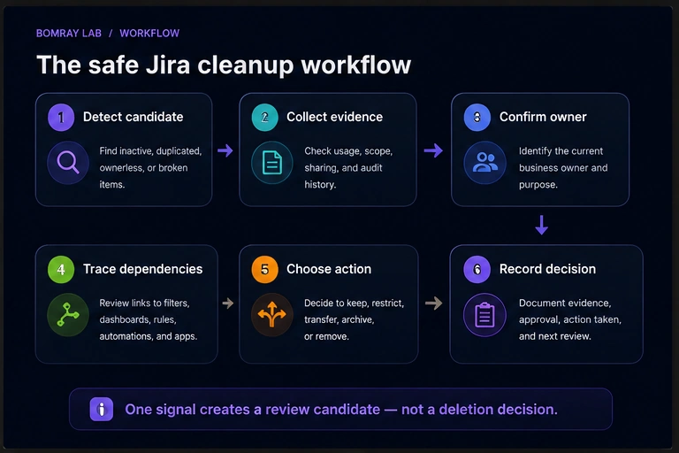
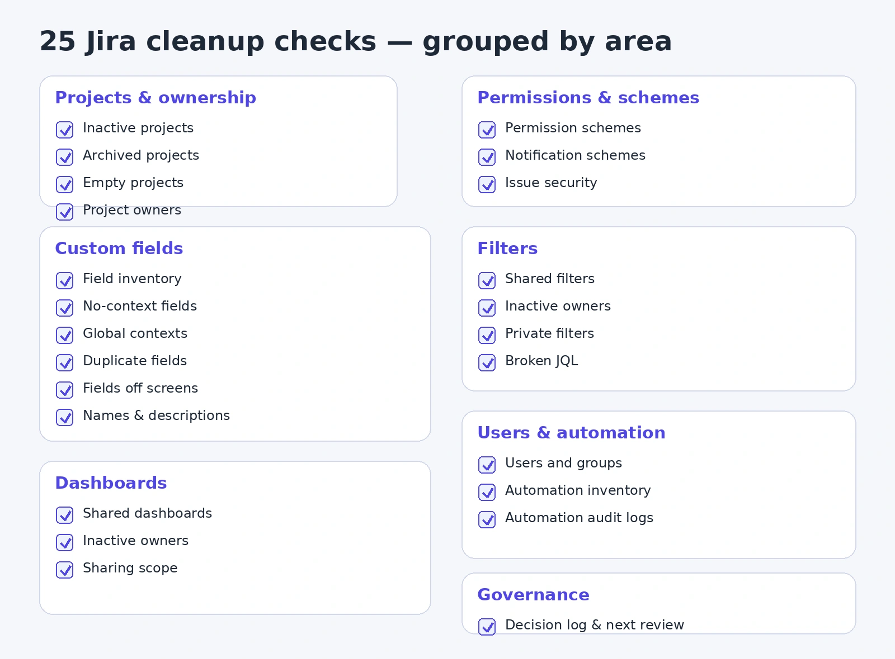
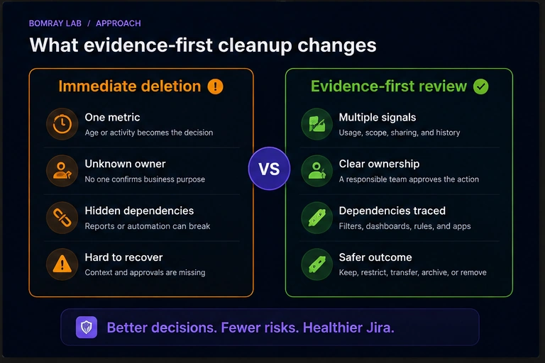

Jira cleanup should begin with evidence, not deletion.

A mature Jira Cloud site can contain years of projects, custom fields, filters, dashboards, schemes, groups, and automation rules. Some are essential. Some are abandoned. Others look unused but still support reports, integrations, or processes that run only a few times each year.

That makes cleanup a governance task rather than a bulk-removal exercise.

> **Quick answer**
>
> Review ownership, usage, scope, dependencies, and retention before changing anything. Prefer reversible actions such as restricting, transferring, consolidating, or archiving. Delete only after the business owner and the Jira administrator agree that the item is no longer required.

## Search Intent

People searching for a Jira cleanup checklist usually need three things:

- a list of objects to review;
- a safe order of operations;
- a repeatable process they can use again.

This guide covers all three for Jira Cloud administrators.

## Why This Matters

Configuration growth is normal. Teams create projects for temporary initiatives. Users build filters for a single report and never return to them. New fields appear because an existing field is hard to find or poorly named. Dashboards remain shared after their owners leave.

The problem is not simply that old objects exist. The problem is uncertainty.

When administrators cannot tell who owns an object, what depends on it, or whether it is still required, every change becomes slower and riskier. A cleanup review creates the evidence needed to make those decisions.

A healthy process can help you:

- reduce configuration sprawl;
- make fields, filters, and dashboards easier to find;
- identify inactive or unclear ownership;
- narrow field contexts where appropriate;
- remove broken reporting dependencies;
- prepare for migrations and major changes;
- document decisions for future administrators.

Atlassian supports archiving projects so inactive work can be removed from normal use while remaining available for reference. Archived work is not the same as deleted work, and shared configuration may still be used elsewhere. That is why archiving is often safer than immediate deletion, but it does not replace a full review.

## The Safe Jira Cleanup Workflow

Use this sequence for every object you review:

1. **Detect a candidate.** Find an object that appears inactive, duplicated, oversized, broken, or ownerless.
2. **Collect evidence.** Check activity, scope, sharing, references, and audit history.
3. **Confirm ownership.** Identify the current business owner, not only the configured Jira owner.
4. **Trace dependencies.** Review filters, dashboards, automation, schemes, integrations, and documentation.
5. **Choose an action.** Keep, restrict, transfer, consolidate, archive, remove, or investigate.
6. **Record the decision.** Save the evidence, approver, action date, and rollback notes.

A single signal—such as age, zero favourites, or no screen placement—is not enough to justify deletion.

## The 25-Point Jira Cleanup Checklist

Use the image above as the quick checklist. The sections below explain what each check means and what evidence to collect.

## Projects and Ownership

### 1. Review inactive projects

Start with projects that have no meaningful activity during your chosen review window.

Check:

- the latest issue update;
- unresolved work;
- future releases or recurring work;
- filters, dashboards, automation, and integrations that reference the project;
- confirmation from a current owner.

“No recent updates” means “review this project,” not “delete this project.”

### 2. Review archived projects

Archived projects can also accumulate.

Confirm why each project was archived, whether the decision was documented, whether retention requirements still apply, and whether filters or dashboards still use its data.

### 3. Find empty or near-empty projects

An empty project may be an abandoned test, a template, a failed import, or a project created for an integration.

Before removing it, review its schemes, roles, components, versions, automation, and connected apps.

### 4. Confirm project leads and business owners

The configured project lead is not always the current business owner.

Record the Jira lead, operational owner, technical contact, retention owner, and final decision maker. If ownership is unclear, classify the project as **Investigate**.

### 5. Review project roles

Look for former employees, overly broad groups, duplicate groups, and project roles that no longer match how the permission scheme is intended to work.

## Permissions and Schemes

### 6. Review permission schemes

Find schemes that are unused, duplicated, poorly named, or attached only to inactive projects.

Do not consolidate schemes based on names alone. Compare every permission and the effective users, groups, and roles behind it.

### 7. Review notification schemes

Check whether recipients still need each event, whether obsolete groups are referenced, and whether duplicate notifications reach the same people.

Test changes with project owners because technically cleaner notification settings can still disrupt operations.

### 8. Review issue security schemes

Confirm which projects use the scheme, what each security level means, and who can access existing restricted issues.

Do not remove a security level until you understand what happens to issues already assigned to it.

## Custom Fields

### 9. Build a custom-field inventory

For each field, capture:

- name and field ID;
- field type;
- description;
- context;
- associated projects and issue types;
- screen placement;
- usage;
- owner;
- similarly named fields.

Use field IDs in documentation because names can be changed or duplicated.

### 10. Review fields with no defined context

Atlassian’s field optimization guidance identifies fields with no defined contexts as cleanup candidates.

Still verify whether the field was intentionally retired, belongs to an app, is planned for a future rollout, or contains historical data.

### 11. Review global contexts

Global contexts make a field available across the site. That may be correct for organization-wide data, but unnecessary global scope increases configuration reach.

Ask whether the field is genuinely required everywhere, whether narrower contexts would match actual use, and whether changing scope would affect automation, imports, reports, or apps.

### 12. Find duplicate or confusing fields

Compare fields such as “Customer,” “Customer Name,” and “Client” by type, context, options, usage, screen placement, JQL, automation, and app dependencies.

If consolidation is justified, define how existing values will be migrated before removing anything.

### 13. Review fields not placed on screens

A field that is not on a screen may still be populated through automation, APIs, integrations, imports, or Marketplace apps. It may also remain important for historical search and reporting.

Treat screen absence as a review signal, not proof of non-use.

### 14. Improve field names and descriptions

Poor naming causes future duplication.

Update field names, descriptions, option labels, context names, ownership notes, and internal documentation where needed.

## Filters

### 15. Review shared filters

For each shared filter, record:

- owner;
- sharing scope;
- JQL validity;
- purpose;
- favourites;
- dashboard or subscription dependencies;
- referenced projects and fields.

A filter with few favourites may still power an important dashboard or scheduled subscription.

### 16. Transfer filters owned by inactive users

Identify the team that still relies on the filter, validate the JQL and sharing, then transfer ownership to someone who understands its purpose.

Avoid assigning every abandoned filter to a Jira administrator.

### 17. Review private filters carefully

Private filters are harder to evaluate and may involve account-access or privacy rules.

Focus first on shared objects and follow your organization’s offboarding and privacy process for private content.

### 18. Test important JQL

Broken queries often result from renamed fields, deleted options, removed projects, or changed permissions.

Run the filter, validate its result set with the owner, and check hard-coded users, relative dates, ordering, and performance.

## Dashboards

### 19. Inventory shared dashboards

Capture the dashboard owner, viewers, editors, business purpose, gadgets, saved filters, and last review date.

A dashboard is only as reliable as the filters and permissions beneath it.

### 20. Review dashboards owned by inactive users

Identify the audience, inspect each gadget, trace saved filters, and transfer ownership only if the dashboard is still required.

Review the dependent filters at the same time.

### 21. Review dashboard sharing

Check whether dashboards are shared with specific groups, project roles, the full organization, or the public.

Public sharing requires particular care. Review both the site-level setting and each dashboard’s individual sharing configuration.

## Users and Groups

### 22. Review users, groups, and administrator access

Coordinate this work with your identity and access process.

Check inactive accounts, suspended users, former administrators, unused groups, product access, site-admin access, and emergency accounts.

Do not remove groups until you have searched for their use in permissions, notifications, issue security, filters, dashboards, and app configuration.

## Automation

### 23. Inventory automation rules

Record scope, owner, enabled status, trigger frequency, recent results, actions, connected services, and business criticality.

Disabled rules are not automatically obsolete. They may be seasonal, temporarily paused, or retained for recovery.

### 24. Review automation audit logs

The automation audit log shows when a rule ran, its status, and details about the steps attempted.

Look for repeated failures, rules that never trigger, unexpected volume, authorization errors, missing fields, invalid values, and duplicate rules.

## Governance

### 25. Record decisions and schedule the next review

For every reviewed object, record:

- object type and ID;
- evidence;
- owner;
- decision;
- approver;
- decision date;
- action date;
- rollback notes;
- next review date.

Quarterly is a practical baseline for many Jira sites. Larger or rapidly changing environments may need monthly reviews for custom fields, shared content, and automation.

## Best Practices

### Use a consistent outcome model

Use a small set of outcomes:

| Outcome | Use when |
|---|---|
| Keep | The item is active, required, or has a confirmed owner. |
| Restrict | The item is useful but has broader scope or sharing than necessary. |
| Transfer | The item is required but has the wrong or inactive owner. |
| Consolidate | Multiple objects serve the same purpose. |
| Archive | The item is inactive but should remain available for reference. |
| Remove | Dependencies have been checked and the item is no longer needed. |
| Investigate | Evidence is incomplete or ownership is unclear. |

### Prefer reversible actions

Restriction, ownership transfer, consolidation, and archiving are easier to recover from than immediate deletion.

### Review small batches

Small batches make failures easier to trace. Avoid changing hundreds of objects during one maintenance window.

### Keep an exception list

Annual projects, compliance records, incident templates, disaster-recovery rules, executive reports, and integration-only fields can all look inactive.

Document exceptions so they do not return as unexplained findings every quarter.

### Separate detection from approval

The person or tool that identifies a candidate should not automatically decide that it is safe to remove. Detection creates a review queue. Owners and administrators make the decision.

## Common Mistakes

### Deleting fields based only on issue counts

Historical values, JQL, automation, reports, APIs, and apps may still depend on the field.

### Treating zero favourites as zero usage

A filter may support a dashboard, subscription, embedded report, or shared link without many favourites.

### Assuming archiving completes cleanup

Fields, schemes, filters, dashboards, and automation still require separate review.

### Transferring everything to the Jira admin

That creates a new ownership problem. Assign ownership to the team responsible for the business outcome.

### Using one inactivity threshold everywhere

Operational, seasonal, compliance, and template projects have different activity patterns.

### Skipping the decision log

Without evidence and approvals, future administrators cannot explain why an item was kept or removed.

## Before and After: What Good Cleanup Changes

A good cleanup process does not simply reduce object counts.

It improves four things:

- **clarity:** every important object has a known purpose;
- **ownership:** someone is responsible for maintaining it;
- **scope:** fields, filters, dashboards, and permissions are no broader than necessary;
- **recoverability:** decisions are documented and risky actions are reversible where possible.

## FAQ

### How often should Jira be reviewed?

Quarterly is a useful baseline. Review fast-growing areas more often when your organization adds teams, projects, fields, or automation frequently.

### Should inactive projects be deleted?

Not immediately. Confirm ownership, unresolved work, retention, reporting, filters, dashboards, automation, and integrations first. Archive when that meets the requirement.

### How do I identify an unused custom field?

Use multiple signals: context, screen placement, issue usage, JQL, automation, reports, imports, APIs, historical data, and app dependencies.

### Are fields with no context safe to remove?

They are strong review candidates, but still confirm why they exist and whether they contain historical data or belong to an app or planned rollout.

### Can I delete a filter with no favourites?

Not based on favourites alone. Check dashboards, subscriptions, documentation, shared links, and ownership.

### What should I do with dashboards owned by former employees?

Confirm the audience and purpose, trace dependent filters, then transfer or remove the dashboard through your governance process.

### Should disabled automation rules be deleted?

Review the owner, business purpose, last execution, audit history, and documentation first.

### Is archiving the same as deleting?

No. Archiving preserves content and changes how it appears and can be edited. It does not necessarily remove shared configuration or dependencies.

### Can Jira cleanup be automated?

Detection and evidence collection can be automated. Final decisions should remain controlled, especially for deletion, permissions, ownership, security, and retention-sensitive content.

## Summary

A safe Jira cleanup process asks:

- What is this object for?
- Who owns it?
- How is it used?
- What depends on it?
- What is the safest action?
- How will we record the decision?

Apply the checklist in small, evidence-based batches. Start with ownership and scope, trace dependencies, prefer reversible actions, and document every decision.

Manual review works well for smaller Jira sites. As environments grow, collecting evidence across projects, fields, filters, and dashboards becomes more time-consuming. [Needs Attention for Jira](/apps/needs-attention-for-jira/) can help surface review candidates while leaving every decision to Jira administrators.

## Related Articles

- [How to Identify Unused Custom Fields in Jira](/resources/how-to-identify-unused-custom-fields-in-jira/)
- [Jira Dashboard Ownership: What Admins Should Review](/resources/jira-dashboard-ownership/)
- [How to Find Unused Filters in Jira](/resources/how-to-find-unused-filters-in-jira/)
- [Needs Attention for Jira](/apps/needs-attention-for-jira/)
- [Bomray Lab Support](/support/)

## Official References

- [Data limits and guardrails](https://support.atlassian.com/jira-cloud-administration/docs/data-limits-and-guardrails/)
- [Configure field contexts](https://support.atlassian.com/jira-cloud-administration/docs/configure-field-contexts-in-your-site/)
- [Optimize fields in your site](https://support.atlassian.com/jira-cloud-administration/docs/optimize-your-custom-fields/)
- [Manage shared filters](https://support.atlassian.com/jira-cloud-administration/docs/manage-shared-filters/)
- [Audit activities in Jira](https://support.atlassian.com/jira-cloud-administration/docs/audit-activities-in-jira-applications/)
