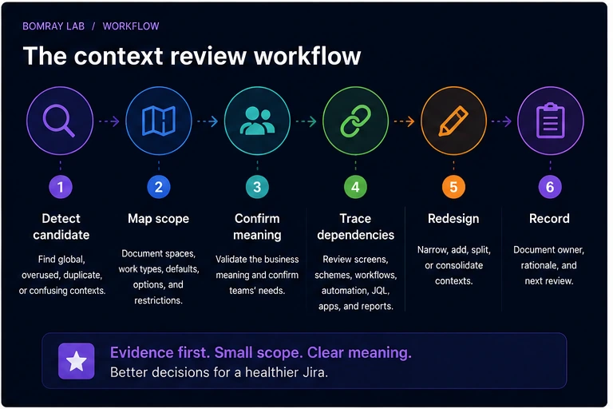
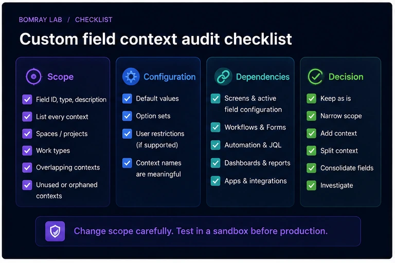
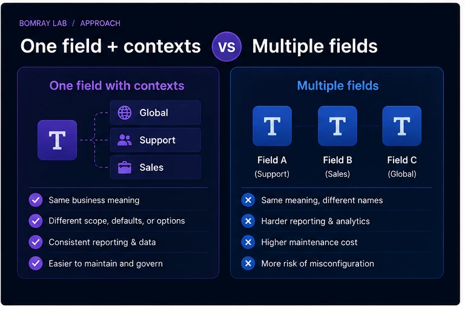

Custom field cleanup is not only about deleting fields. In many Jira Cloud sites, the better fix is to reduce where a valid field applies.

That is what custom field contexts are for.

A context controls where a field variant is available and can also define defaults, option sets, or restrictions for supported field types. Used well, contexts can reduce noise and prevent teams from creating duplicate fields for the same business concept.

> **Quick answer**
>
> Before creating or deleting a Jira custom field, inspect its contexts. If the field represents a valid shared concept but is available too broadly, narrow the context to the required spaces and work types. Use additional contexts only when teams genuinely need different defaults, options, or supported restrictions. Always trace screens, schemes, workflows, Forms, automation, JQL, and reporting before changing scope.

## Search Intent

People searching for **Jira custom field context**, **Jira field scope**, or **reduce Jira custom fields** typically want to solve one of these problems:

- a field appears in too many projects;
- teams created duplicate fields with slightly different options;
- changing options would affect unrelated teams;
- the administrator wants to reduce custom field sprawl without losing data.

This guide focuses on using contexts as a governance tool.

## What a Custom Field Context Does

Atlassian defines a context as configuration that controls where a field appears and how a variant of the field behaves.

A context can specify:

- spaces/projects;
- work types;
- default values for supported fields;
- different option sets;
- restrictions on selectable users for supported user fields.

When a custom field is created, Jira automatically creates a context.

The key design idea is this:

**One business concept does not always require many custom fields. Sometimes it requires one field with controlled contexts.**

## Context Review Workflow

Use:

**Detect → Map Scope → Confirm Meaning → Trace Dependencies → Redesign → Record**

### Detect

Look for:

- global contexts with only a few real users;
- duplicate fields with similar meaning;
- different teams using different option sets;
- fields appearing in unrelated spaces;
- context names nobody understands;
- old contexts tied to retired spaces.

### Map scope

Record every context and where it applies.

### Confirm meaning

Decide whether teams are actually capturing the same business concept.

### Trace dependencies

Review the same dependency chain used in [How to Find and Clean Up Unused Custom Fields in Jira Cloud](/resources/jira-unused-custom-fields/).

### Redesign

Keep, narrow, split context, consolidate, or investigate.

### Record

Document why the context exists and who owns the field semantics.

## Quick Context Audit Checklist

- [ ] Record field ID, type, and description.
- [ ] List every context.
- [ ] Record spaces/projects included in each context.
- [ ] Record work types included in each context.
- [ ] Review default values.
- [ ] Review option sets.
- [ ] Review user restrictions where supported.
- [ ] Identify overlapping or confusing contexts.
- [ ] Check screens and active field configuration.
- [ ] Check workflows and Forms.
- [ ] Check automation and JQL.
- [ ] Check dashboards and reporting.
- [ ] Check apps and integrations.
- [ ] Compare duplicate fields with the same business meaning.
- [ ] Choose Keep, Narrow, Split, Consolidate, or Investigate.
- [ ] Record owner and rationale.

## Step 1: Map the Current Contexts

Atlassian's current Jira Cloud administration path provides **Fields → More actions → Contexts and default value** for reviewing a field's contexts.

The context overview shows how each context is configured.

Build a small table:

| Context | Spaces | Work types | Options/defaults | Owner |
|---|---|---|---|---|
| Global | All | All | Default set | Platform |
| Support | Support spaces | Incident, Request | Support options | Support Ops |
| Sales | Sales space | Task | Sales options | RevOps |

The goal is to make hidden scope visible.

## Step 2: Find Overly Broad Global Contexts

A global context is convenient during creation, but it can become unnecessary as the site grows.

Ask:

- Is the field actually needed in every space?
- Is it only used in two departments?
- Do unrelated teams see it because nobody narrowed the context?
- Does global availability encourage new dependencies?

If a field is broadly available but legitimately used in a narrow area, **Restrict/Narrow** is usually a better cleanup action than deletion.

## Step 3: Understand Project and Work-Type Scope

Contexts can be targeted by space and work type.

This is important because the same space may have work types with very different data requirements.

For example, a field called `Escalation Reason` might be valid for Incident work but irrelevant for normal Tasks.

A well-designed context can prevent that field from becoming universal clutter.

## Step 4: Use Contexts to Avoid Duplicate Fields

Suppose two teams both need a `Customer Tier` field.

Team A uses:

- Gold
- Silver
- Bronze

Team B uses:

- Strategic
- Growth
- Standard

The first reaction might be to create two custom fields.

But if both fields represent the same underlying business concept and cross-team reporting would benefit from one field identity, separate contexts with different options may be a better model.

Do not force consolidation when meanings differ. Contexts solve variation in configuration, not ambiguity in semantics.

## Step 5: Review Defaults and Option Sets

Atlassian supports advanced field options through contexts, including different option sets and defaults for supported field types.

Review stale options and defaults carefully.

A default value can silently create data that looks intentional when users never actively selected it.

Ask:

- Is the default still valid?
- Does it distort reporting?
- Are deprecated options still selectable?
- Should options differ by space?

Context cleanup can improve data quality as well as administration.

## Step 6: Check Overlap Before Editing

Atlassian warns that editing a context affects all spaces and work types that use it.

That means context changes are shared configuration changes.

Before editing:

- enumerate affected spaces;
- identify owners;
- test expected options;
- verify workflows and Forms;
- communicate changes if users will notice them.

Do not treat a context as private configuration for the team currently asking for a change.

## Step 7: Trace Dependencies Outside the Context Page

The context page does not tell the whole story.

Check:

- screens;
- field schemes/configurations;
- workflow validators and post-functions;
- Forms;
- automation;
- JQL;
- dashboards;
- reports;
- Marketplace apps;
- REST/API consumers.

Narrowing a context changes where the field applies, which may affect consumers that expect it in a particular space or work type.

## Step 8: Choose the Right Context Action

### Keep

The context accurately represents current scope.

### Narrow

The field is valid but applies to too many spaces or work types.

### Split context

Different teams need different options, defaults, or supported restrictions for the same field concept.

### Consolidate

Duplicate fields can become one governed field with appropriate contexts.

### Investigate

Semantic meaning or dependency impact is unclear.

### Remove field

Only after the broader unused-custom-field review proves the field itself is no longer required.

## Contexts vs Duplicate Fields

| Question | One field + contexts | Multiple fields |
|---|---|---|
| Same business meaning? | Strong fit | Usually unnecessary |
| Different option sets? | Supported | Also possible |
| Cross-team reporting | Easier with one field | Requires reconciliation |
| Different data types | Not possible | Separate fields required |
| Completely different meaning | Poor fit | Better choice |
| Governance complexity | Context complexity | Field-count complexity |

Atlassian also documents that once a field is created, its type cannot be changed. Different data types therefore require separate fields.

## Design Patterns for Healthy Contexts

Contexts become easier to manage when administrators use a few repeatable patterns.

### Pattern 1: Narrow shared field

Use one field for one shared business concept, but apply it only to the spaces and work types that need it.

Example: `Customer Contract ID` applies to support requests and implementation tasks, not every Jira space.

This avoids two common problems: a global field that appears everywhere and duplicate fields created by each participating team.

### Pattern 2: Shared meaning, different options

Use multiple contexts when teams share the same underlying concept but need different option sets.

Example: `Service Tier` may be a single reporting concept while internal service teams have different selectable values.

Before using this pattern, confirm that values can still be interpreted correctly in cross-space reports.

### Pattern 3: Same label, different meaning

Do **not** consolidate fields merely because users gave them the same label.

`Priority Reason` in a support escalation process may mean something completely different from `Priority Reason` in a portfolio-planning process.

If semantics differ, separate fields can be more honest than one overloaded field with contexts.

### Pattern 4: Temporary context for migration

A migration may temporarily require a field in additional spaces.

If you create a temporary context, give it:

- a descriptive name;
- an owner;
- a review date;
- a documented reason.

Temporary configuration without an expiry path is how permanent sprawl begins.

## How to Review a Context Change Safely

Changing context scope can alter where a field is available. Treat it as a shared configuration change.

### Before

Record:

- field ID;
- context name;
- current spaces and work types;
- current options/default;
- screens and schemes;
- workflows and Forms;
- automation/JQL;
- reports and integrations.

### During

Make one scoped change at a time where practical.

If you remove several spaces and work types from a context in one action, it becomes harder to identify which removal caused an unexpected dependency failure.

### After

Validate representative work items in:

- a space that should retain the field;
- a space removed from scope;
- each work type with different context behavior.

Then run important JQL, automation, Forms, and reports.

## Context Consolidation Example

Suppose the site contains:

- `Customer Segment` — global, 12 options;
- `Customer Segment - Sales` — Sales space only, 5 options;
- `Customer Segment New` — two recently migrated spaces.

The names suggest duplication, but do not decide yet.

### Collect evidence

Compare field types, values, contexts, workflow references, automation, JQL, and reports.

### Confirm semantics

Ask business owners whether all three represent the same segmentation model.

### Design target

If the meaning is the same, choose one canonical field and contexts such as:

- Sales context;
- Support context;
- Migration context with a defined end date.

### Migrate dependencies

Update data, automation, Forms, JQL, and reports before deleting redundant fields.

### Validate

Make sure a user in each target space sees the correct options.

Only then remove obsolete fields.

## Context Governance Questions

During quarterly or migration reviews, ask:

- Does every context have a reason to exist?
- Does every non-global context have a clear audience?
- Are global contexts truly global?
- Are old spaces still listed?
- Are option sets still current?
- Are defaults producing unintended values?
- Could two duplicate fields become one field with contexts?
- Is one field being stretched across meanings that should be separated?

The goal is not the smallest possible number of contexts. The goal is understandable scope.

## Relationship to Unused Field Cleanup

A field can be:

- useful and correctly scoped;
- useful but too broadly scoped;
- duplicated;
- genuinely unused.

Only the last state points directly toward field removal.

This is why context review should happen before destructive field cleanup. A field that irritates users in dozens of unrelated spaces may be perfectly valid in two spaces. Narrowing the context fixes the actual problem while preserving the valid data model.

## Best Practices

### Start with semantics, not configuration

First decide whether teams mean the same thing. Then choose contexts or separate fields.

### Use context descriptions

A context description should explain why it exists and who it serves.

### Avoid global-by-default governance

Global context is easy, but not always appropriate for mature sites.

### Review duplicate fields before creating another

Search existing fields and contexts first.

### Keep reporting in mind

One shared field identity can simplify cross-space reporting when the semantics are truly common.

## Common Mistakes

### Creating a new field for every team

This increases field count and makes reporting harder.

### Narrowing a context without checking consumers

Automation or JQL may assume the field applies to a space being removed.

### Using one field for different meanings

Contexts should not hide semantic differences.

### Ignoring defaults

Defaults can create misleading data.

### Deleting a field when scope is the real problem

Context cleanup is often the safer fix.

## Before and After

| Before | After |
|---|---|
| Global field everywhere | Field scoped to real users |
| Duplicate fields by team | Shared field with intentional contexts |
| Context names unclear | Named contexts with owners |
| Options copied between fields | Context-specific option sets |
| Reporting requires mapping | Shared field identity where appropriate |

## FAQ

### What is a Jira custom field context?

It is configuration that defines where a field variant applies and can control defaults, options, and supported restrictions.

### Does every custom field have a context?

Yes. Atlassian states that creating a custom field automatically creates a context.

### Can a field have multiple contexts?

Yes. Administrators can create additional contexts for different spaces and work types.

### Can contexts use different option sets?

Yes, for supported field types.

### Can I change a field's type through a context?

No. Atlassian states that a field's type cannot be changed after creation.

### Should I use contexts instead of duplicate fields?

Use contexts when the business meaning and field type are the same but scope or options differ. Use separate fields when the underlying meaning or data type is genuinely different.

### Can narrowing a context break dependencies?

It can affect workflows, Forms, automation, JQL, and other consumers in removed scope. Review dependencies first.

## Summary

Custom field sprawl is often a scope-design problem.

Before deleting or creating fields:

- map contexts;
- confirm business meaning;
- narrow unnecessary global scope;
- use context-specific options where appropriate;
- consolidate only when semantics truly match;
- trace workflows, Forms, automation, JQL, reporting, apps, and APIs;
- document context ownership.

[Needs Attention for Jira](/apps/) can help surface fields that deserve review, but context design remains an administrator and business-governance decision.

## Official References

- <a href="https://support.atlassian.com/jira-cloud-administration/docs/configure-field-contexts-in-your-site/" target="_blank" rel="noopener noreferrer">Configure field contexts in your site — Atlassian Support</a>
- <a href="https://support.atlassian.com/jira-cloud-administration/docs/create-a-field-context-and-define-where-its-used/" target="_blank" rel="noopener noreferrer">Create a field context and define where it's used — Atlassian Support</a>
- <a href="https://support.atlassian.com/jira-cloud-administration/docs/add-a-context-to-a-custom-field/" target="_blank" rel="noopener noreferrer">View a field context and how it's set up — Atlassian Support</a>
- <a href="https://support.atlassian.com/jira-cloud-administration/docs/configure-advanced-field-options-using-contexts/" target="_blank" rel="noopener noreferrer">Configure advanced field options using contexts — Atlassian Support</a>
- <a href="https://support.atlassian.com/jira-cloud-administration/docs/field-types-you-can-create-as-a-jira-admin/" target="_blank" rel="noopener noreferrer">Field types you can create as a Jira admin — Atlassian Support</a>
