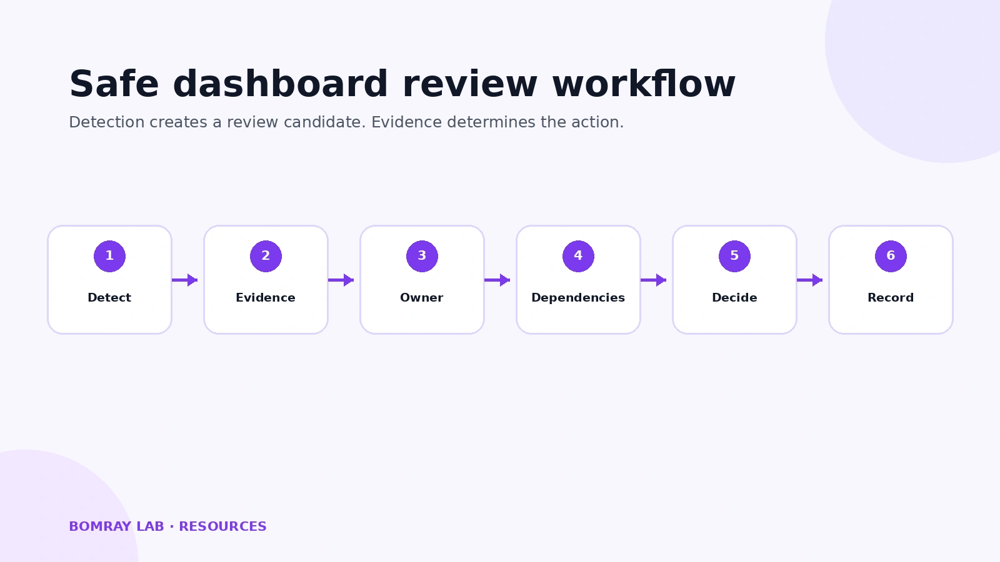
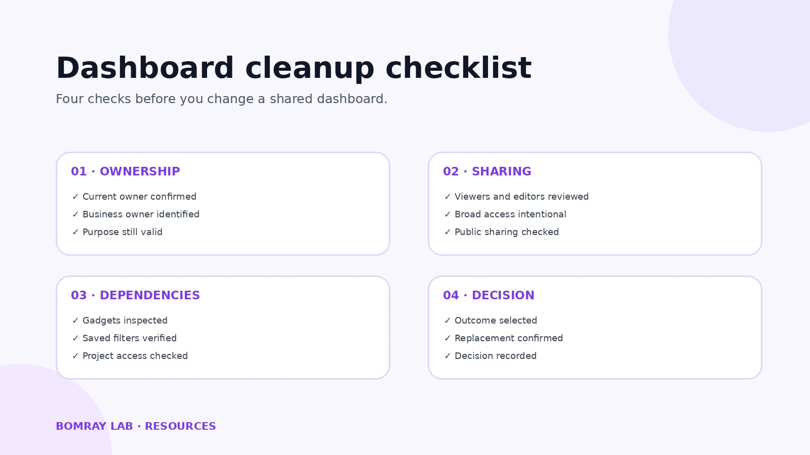
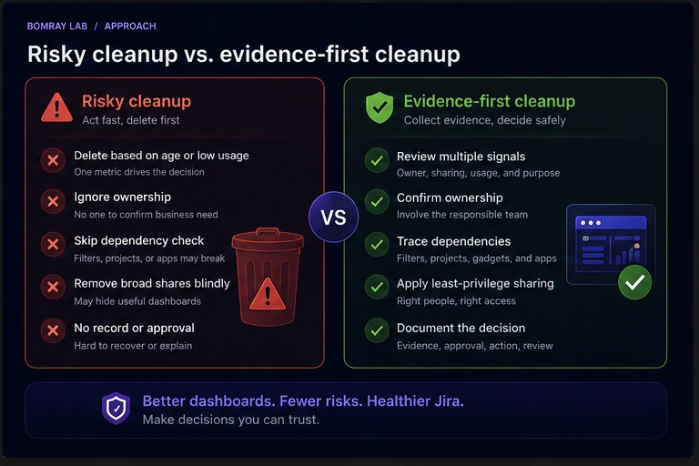

Jira dashboard cleanup should begin with ownership and dependencies, not deletion.

A shared dashboard can outlive the team, project, or reporting process that created it. The page may still open while its owner is no longer responsible, its sharing is broader than intended, or a gadget depends on a private or deleted filter.

That makes dashboard cleanup a governance task rather than a visual tidy-up.

> **Quick answer**
>
> Review the dashboard owner, intended audience, sharing, gadgets, saved filters, and project access before changing or removing anything. Keep useful dashboards, transfer ownership when responsibility changes, restrict unnecessary sharing, repair broken dependencies, and move a dashboard to trash only after its purpose is confirmed obsolete.

## Search Intent

People searching for Jira dashboard cleanup usually need to answer practical administration questions:

- Which shared dashboards deserve review?
- What should be checked before a dashboard is removed?
- How should dashboards owned by former or inactive users be handled?
- Why can a shared dashboard contain gadgets that do not work for its viewers?
- How should public or overly broad sharing be reviewed?
- When is reassignment or repair safer than removal?

This guide provides an evidence-first workflow for Jira Cloud administrators.

For a site-wide review that also covers projects, custom fields, filters, permissions, users, and automation, use the [Jira Cleanup Checklist](/blog/jira-cleanup-checklist/).

## Why This Matters

Dashboards sit above several other Jira objects.

A dashboard contains gadgets. Some gadgets use saved filters. Those filters have their own owners and sharing settings, and the projects returned by the filters have their own access controls.

Atlassian documents three permission layers that can affect data shown on a shared dashboard:

1. the dashboard must be shared with the user;
2. the filter used by the gadget must be shared with the user;
3. the user must have access to the projects used by the filter.

A dashboard can therefore be visible while an important gadget still returns no data or reports that its filter cannot be retrieved.

Ownership creates a second maintenance problem. Jira administrators with the **Administer Jira** global permission can search shared dashboards and change their ownership. Atlassian's shared-dashboard administration view exposes the current owner, shares, and popularity—the number of users who have starred the dashboard.

These are useful review signals, but none of them proves that a dashboard is safe to delete.

A low star count does not mean zero business value. An old dashboard may support a quarterly process. A former owner does not make the dashboard obsolete. Broad sharing may be intentional.

The administrator's job is to turn those signals into evidence.

## The Safe Jira Dashboard Review Workflow

Use the same sequence for every dashboard:

1. **Detect a candidate.** Find a dashboard with unclear ownership, unusual sharing, broken gadgets, duplication, or an uncertain purpose.
2. **Collect evidence.** Review the owner, shares, popularity, dashboard description, gadgets, and intended audience.
3. **Confirm ownership.** Identify who is responsible for the reporting process today.
4. **Trace dependencies.** Check saved filters, filter sharing, project access, and any app-provided gadgets.
5. **Choose an action.** Keep, restrict, transfer, repair, consolidate, or remove.
6. **Record the decision.** Note why the action was taken, who approved it, and what replaces the dashboard if applicable.

Detection and action should remain separate. A dashboard enters the review queue because something looks unusual; it leaves the queue only after the administrator has enough evidence to make a decision.

## Jira Dashboard Cleanup Checklist

Use the image above as the quick review card. The sections below explain what to verify and why.

## Ownership and Purpose

### 1. Inventory shared dashboards

Start from Jira's administrative shared-items view:

**Settings → System → Shared items → Dashboards**

Atlassian states that administrators with the required global permission can search dashboards from this area and see the current owner, shares, and popularity.

Use these values to prioritize investigation rather than to automate removal.

A practical inventory can record:

- dashboard name;
- owner;
- sharing scope;
- popularity;
- stated purpose;
- responsible team;
- review status.

Do not spend the first pass proving whether every dashboard is obsolete. The first pass should identify which dashboards need deeper review.

### 2. Confirm the current owner

The configured owner tells you who owns the Jira object. It does not always tell you who owns the business process behind it.

If the owner has changed roles, left the team, or no longer understands the report, identify the current responsible person before making changes.

Atlassian allows a Jira administrator with the **Administer Jira** global permission to change dashboard ownership and recommends checking with the existing owner before making changes.

Transfer ownership when the dashboard is still useful but responsibility has moved.

Avoid transferring every orphaned dashboard to the Jira administrator. That makes the configuration look cleaner while concentrating business ownership in the wrong place.

### 3. Confirm the dashboard's purpose

Names such as `Engineering Dashboard`, `Engineering Dashboard New`, and `Engineering Dashboard 2025` are not enough to identify the authoritative version.

Open the dashboard and determine:

- what decision or workflow it supports;
- who consumes it;
- whether a newer dashboard replaced it;
- whether it is seasonal or used only for periodic reporting;
- whether the description still matches the current purpose.

If nobody can confirm the purpose, classify the dashboard as **Investigate** rather than deleting it immediately.

## Sharing and Access

### 4. Review viewers and editors

Dashboard visibility and dashboard ownership are separate concerns.

A dashboard may have the correct owner while being shared with more people than necessary. Review who can view it and who can edit it.

Atlassian supports dashboard sharing based on the permissions and sharing options available in the site. The dashboard owner or permitted editors can update sharing through the dashboard's sharing settings.

Ask:

- Who needs to view this report?
- Who needs to change its layout or gadgets?
- Is organization-wide access necessary?
- Are old groups or audiences still included?
- Does the current sharing match the dashboard's actual purpose?

Restricting unnecessary access can be the correct cleanup action even when the dashboard itself remains valuable.

### 5. Review public dashboards separately

Public sharing requires a deliberate review.

Atlassian states that Standard, Premium, and Enterprise Jira sites can allow dashboards and filters to be shared publicly, while Free Jira sites cannot be opened to the public. Public sharing must first be allowed at the site level.

A crucial detail is that disabling the site-level public-sharing setting does **not** automatically restrict dashboards or filters that were already shared publicly. Existing public items must be reviewed and their visibility changed separately.

Jira administrators can identify publicly shared filters and dashboards from the relevant administration pages, where public items are marked as shared with the public.

If your organization does not intentionally publish Jira dashboards, public visibility should be treated as a high-priority review signal.

## Gadgets and Dependencies

### 6. Inspect every important gadget

A dashboard's gadgets usually reveal its real purpose better than its title.

Review gadgets for:

- errors;
- empty results;
- outdated reporting logic;
- duplicate information;
- references to old projects;
- saved-filter dependencies;
- app-provided functionality that may no longer be required.

Do not assume an empty gadget is obsolete.

What an administrator sees can differ from what another viewer sees because dashboard, filter, and project permissions all affect the resulting data.

### 7. Trace saved filters

Saved filters are one of the most important dashboard dependencies.

Atlassian documents a Jira Cloud error where a gadget reports that its configured filter could not be retrieved. One documented cause is that the filter is private. If the filter owner is no longer available, an administrator can use filter administration to change its ownership. If the filter was deleted, a replacement filter query must be created.

For filter-based gadgets, confirm:

- the filter still exists;
- its owner is appropriate;
- the intended dashboard audience can access it;
- its query still represents the intended report;
- referenced projects still exist and remain relevant.

This is why dashboard cleanup and filter cleanup should be coordinated.

Do not delete an apparently unused saved filter until you have considered whether a dashboard depends on it.

### 8. Check the full permission chain

When a gadget works for one user and fails for another, inspect the full access path rather than changing the gadget immediately.

The relevant chain is:

**Dashboard access → Filter access → Project access**

If any layer fails, the viewer may not receive the expected gadget data.

This distinction matters during cleanup because a permission problem should normally be repaired or intentionally restricted—not mislabeled as an obsolete dashboard.

### 9. Review app-provided gadgets carefully

Jira Cloud can include built-in gadgets as well as gadgets provided by Marketplace apps.

If a dashboard contains an app-provided gadget, confirm that the app is still installed, supported, and required by the reporting process before changing the dashboard.

Do not infer that a third-party gadget is safe to remove simply because its output currently looks broken. Establish whether the problem is the gadget, the app, its configuration, or its underlying data access.

## Duplicates and Consolidation

### 10. Compare similar dashboards before consolidating

Jira allows dashboards to be copied, so similar dashboards may be intentional.

Before consolidating two dashboards, compare:

- owner;
- audience;
- gadgets;
- filter dependencies;
- reporting purpose;
- edit responsibility.

Two dashboards with nearly identical layouts may serve different teams or permission boundaries.

Consolidate only when the duplicated purpose is confirmed and users have a clear replacement.

### 11. Review the dependent filters at the same time

Consolidating dashboards without reviewing their filters can leave duplicate or ownerless dependencies behind.

When one dashboard replaces another, determine which filters belong to the retained dashboard, which are shared elsewhere, and which genuinely become candidates for later cleanup.

Do not treat the dashboard as an isolated object.

## Removal and Governance

### 12. Choose an outcome before choosing a deletion action

Use a consistent outcome model.

| Outcome | Use when |
|---|---|
| Keep | Owner, audience, purpose, and dependencies remain valid. |
| Restrict | The dashboard is useful but sharing is broader than necessary. |
| Transfer | The dashboard is useful but ownership no longer matches responsibility. |
| Repair | The dashboard is useful but gadgets, filters, or access need correction. |
| Consolidate | Another dashboard serves the same confirmed purpose. |
| Remove | The dashboard is confirmed obsolete and dependencies have been reviewed. |
| Investigate | Evidence or ownership is still unclear. |

This model prevents cleanup from becoming a binary keep/delete exercise.

### 13. Use trash as a controlled removal step

For dashboards that are confirmed obsolete, Jira Cloud provides a trash mechanism.

Atlassian states that a dashboard moved to trash can be restored only by a Jira administrator and is permanently deleted from the site after **60 days**.

That recovery period is useful, but it does not eliminate the need for review. Users lose normal access when the dashboard is moved to trash.

Before removal, confirm:

- the dashboard is no longer required;
- a replacement exists where necessary;
- dependent filters have been considered;
- relevant stakeholders have been informed;
- the reason for removal is recorded.

### 14. Record the decision

For dashboards with meaningful organizational use, keep a small decision record.

Capture:

- dashboard name;
- owner;
- intended audience;
- purpose;
- evidence reviewed;
- decision;
- approver or responsible owner;
- replacement, if any;
- review or action date.

The objective is not bureaucracy. It is to prevent the next administrator from repeating the same investigation without context.

## Best Practices

### Use multiple signals

Owner status, sharing, popularity, age, gadget health, and duplication are review signals.

None should become a standalone deletion rule.

### Prefer reversible actions

Transfer ownership, narrow sharing, repair filters, or consolidate reporting before choosing removal when those actions solve the actual problem.

### Review dashboards and filters together

A dashboard may be healthy while a dependent filter is private, deleted, or owned by the wrong person.

Treat saved filters as first-class dashboard dependencies.

### Separate access problems from obsolete content

A gadget that returns no data may indicate a permission mismatch rather than an unused dashboard.

Verify dashboard, filter, and project access before changing the report.

### Keep business ownership outside Jira administration where appropriate

Jira administrators should maintain the platform and enable recovery, but they should not automatically become owners of every abandoned business dashboard.

### Review public sharing deliberately

Do not assume disabling future public sharing cleans up existing public items. Atlassian explicitly documents that existing public dashboards and filters need separate visibility changes.

### Review in small batches

Small review batches make owner confirmation and dependency tracing manageable.

A recurring review is safer than a large purge after years of accumulated dashboards.

## Common Mistakes

### Deleting dashboards because they have few stars

Popularity shows how many users have starred a dashboard. It does not prove whether a dashboard is business-critical.

### Treating a former owner as proof of non-use

Ownership may be stale while the dashboard remains essential to a team.

Transfer ownership after confirming the current responsible person.

### Fixing dashboard sharing but ignoring filters

A user can access the dashboard and still fail to retrieve gadget data when the underlying filter or project is unavailable to them.

### Deleting a filter before checking dashboard dependencies

A saved filter may be the source for one or more gadgets.

Review dependent dashboards before deleting the filter.

### Assuming an empty gadget is obsolete

Permission differences can produce empty or failed gadget output for some viewers.

Trace access first.

### Turning off public sharing and assuming existing dashboards are private

Atlassian states that disabling the site-level setting prevents new public sharing but does not automatically restrict items already shared publicly.

Existing public dashboards and filters require separate review.

### Transferring everything to the Jira admin

This replaces missing ownership with inappropriate ownership.

The new owner should understand the dashboard's business purpose.

## Before and After: What Good Dashboard Cleanup Changes

| Risky cleanup | Evidence-first cleanup |
|---|---|
| Delete dashboards with old names | Confirm purpose and owner |
| Treat low popularity as non-use | Use popularity only as a review signal |
| Fix only dashboard sharing | Check dashboard, filter, and project access |
| Delete broken gadgets | Diagnose configuration and dependencies |
| Transfer all orphaned dashboards to admins | Assign a responsible business or team owner |
| Disable public sharing and stop | Review already-public dashboards separately |
| Delete duplicates immediately | Compare audience, gadgets, and filters first |
| Remove and hope trash is enough | Confirm, document, then use the 60-day recovery window |

A successful cleanup does not simply reduce the number of dashboards.

It leaves shared dashboards with clearer ownership, intentional access, working dependencies, and an understandable purpose.

## FAQ

### Can a Jira admin change another user's dashboard owner?

Yes. Atlassian states that users with the **Administer Jira** global permission can change ownership of another user's dashboard. Atlassian recommends checking with the existing owner before making changes.

### Where can Jira admins review shared dashboards?

In Jira Cloud, go to **Settings → System → Shared items → Dashboards**. The administration view can be used to search dashboards and review the current owner, shares, and popularity.

### Does a dashboard with zero or few stars mean it is unused?

No. Popularity is the number of users who have starred the dashboard. It is useful for prioritizing review but does not prove business usage or non-usage.

### Why can users open a dashboard but not see a gadget's data?

Atlassian documents three relevant permission layers: dashboard sharing, filter sharing, and access to the projects used by the filter. A problem at any layer can prevent expected gadget data from appearing.

### What should I do with a dashboard owned by a former employee?

First confirm whether the dashboard is still required and identify the current responsible owner. If it remains useful, transfer ownership and review its filters and sharing at the same time.

### Can Jira dashboards be shared publicly?

Yes, on Jira Standard, Premium, and Enterprise sites when public sharing has been allowed at the site level. Jira Free sites cannot be opened to the public through this setting.

### Does turning off public sharing make existing public dashboards private?

No. Atlassian states that turning off the site-level public-sharing setting does not restrict dashboards or filters that are already publicly shared. Existing items need separate visibility changes.

### What happens when a dashboard is moved to trash?

Atlassian states that trashed dashboards can be restored only by a Jira administrator and are permanently deleted after 60 days.

### Should dashboard cleanup and filter cleanup be done together?

They should be coordinated. Dashboard gadgets can depend on saved filters, so deleting or changing a filter without checking dashboard usage can break reporting.

### How often should Jira dashboards be reviewed?

Atlassian does not prescribe a universal dashboard-cleanup interval in the documentation used for this guide. Choose a cadence based on staff changes, project turnover, dashboard creation volume, and your organization's governance process.

## Summary

A safe Jira dashboard cleanup process asks:

- Who owns this dashboard now?
- Who should view and edit it?
- What purpose does it serve?
- Which gadgets and filters does it depend on?
- Can the intended audience access the full dashboard-filter-project chain?
- Is the right action to keep, restrict, transfer, repair, consolidate, or remove it?

Use unusual ownership, broad sharing, low popularity, errors, and duplication to identify review candidates—not to automate deletion.

Manual review works well for smaller Jira sites. As environments grow, collecting evidence across dashboards and other Jira objects becomes more time-consuming. [Needs Attention for Jira](/apps/) can help surface review candidates while leaving every decision to Jira administrators.

## Official References

- <a href="https://support.atlassian.com/jira-cloud-administration/docs/manage-shared-dashboards/" target="_blank" rel="noopener noreferrer">Manage dashboards</a>
- <a href="https://support.atlassian.com/jira-software-cloud/docs/create-and-edit-dashboards/" target="_blank" rel="noopener noreferrer">Create and edit dashboards</a>
- <a href="https://support.atlassian.com/jira-software-cloud/docs/add-and-customize-gadgets/" target="_blank" rel="noopener noreferrer">Add and customize gadgets</a>
- <a href="https://support.atlassian.com/jira-cloud-administration/docs/manage-shared-filters/" target="_blank" rel="noopener noreferrer">Manage filters</a>
- <a href="https://support.atlassian.com/jira/kb/gadget-on-shared-dashboard-returns-could-not-be-retrieved-error/" target="_blank" rel="noopener noreferrer">Gadget on shared dashboard returns "could not be retrieved" error</a>
- <a href="https://support.atlassian.com/jira/kb/filter-for-this-gadget-could-not-be-retrieved-error-in-jira-dashboard/" target="_blank" rel="noopener noreferrer">"Filter for this gadget could not be retrieved" error</a>
- <a href="https://support.atlassian.com/jira-cloud-administration/docs/allow-dashboards-and-filters-in-your-site-to-be-shared-publicly/" target="_blank" rel="noopener noreferrer">Allow dashboards and filters to be shared publicly</a>
- <a href="https://support.atlassian.com/jira-cloud-administration/docs/view-which-filters-and-dashboards-are-shared-publicly-in-your-site/" target="_blank" rel="noopener noreferrer">View which filters and dashboards are shared publicly</a>
