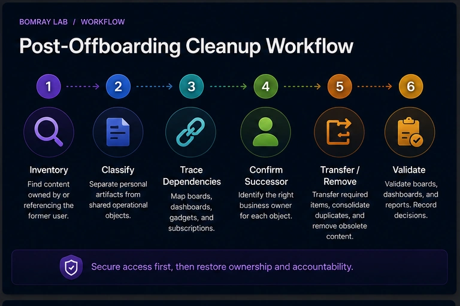
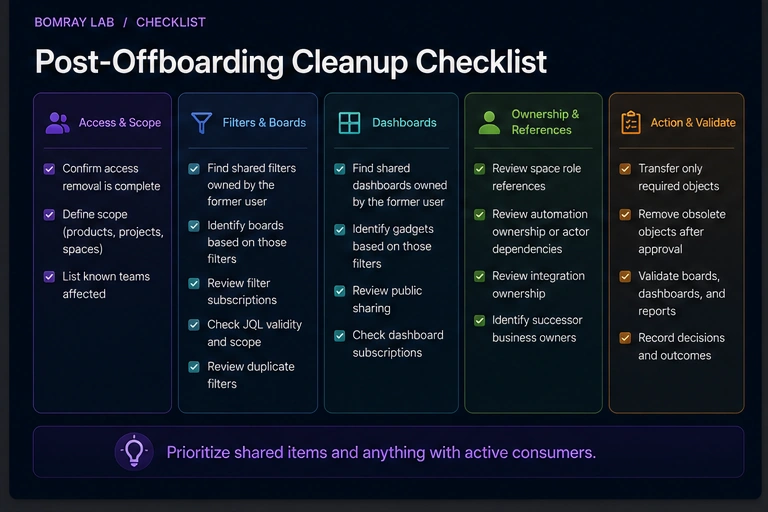
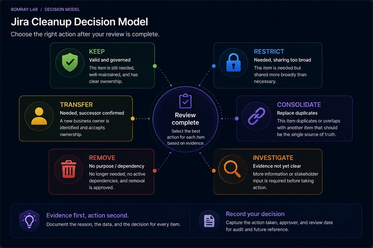

Removing a former employee's Jira access solves the security problem. It does not automatically solve the configuration problem they leave behind.

The former user may still be the recorded owner of saved filters or dashboards. Their filters may power active boards. Their dashboards may still be shared. Subscriptions may continue to represent an operational process that nobody owns.

This is the **second phase** of offboarding.

> **Quick answer**
>
> After access is removed, inventory Jira objects associated with the former user. Prioritize shared filters and dashboards, then trace dependent boards, dashboard gadgets, subscriptions, public sharing, role references, automation, and integrations. Transfer only objects that still have a valid business owner; consolidate duplicates and remove obsolete objects only after dependency review.

## Search Intent

People searching for **Jira former user filter**, **Jira offboarding cleanup**, or **Jira dashboard former user** are not primarily asking how to disable an account.

They are asking:

- What happens to Jira objects after a user leaves?
- How do I repair ownership?
- Could a former user's filter break a board?
- What should be deleted versus transferred?

For the access-removal phase, use the [Jira User Offboarding Checklist for Administrators](/resources/jira-user-offboarding/) once that article is live in your publishing schedule. Until then, this article should be published only after its prerequisite date.

## Why Post-Offboarding Cleanup Is a Separate Task

Offboarding has two different objectives:

### Security objective

Stop the user from accessing systems.

### Governance objective

Restore accountability for operational objects.

Combining both into one giant checklist creates a dangerous failure mode: security access is left active while teams debate whether a dashboard should be transferred.

The safer sequence is:

**Secure access first → clean up ownership second.**

## Post-Offboarding Cleanup Workflow

Use:

**Inventory → Classify → Trace Dependencies → Confirm Successor → Transfer/Remove → Validate**

### Inventory

Find former-user owned or user-referencing objects.

### Classify

Separate personal artifacts from shared operational objects.

### Trace dependencies

Map boards, dashboards, filters, subscriptions, automation, and external consumers.

### Confirm successor

Find a business owner, not merely an available Jira admin.

### Transfer or remove

Use the least disruptive action.

### Validate

Test the consumer after the change.

## Quick Post-Offboarding Checklist

- [ ] Confirm access removal is complete.
- [ ] Search shared filters owned by the former user.
- [ ] Search shared dashboards owned by the former user.
- [ ] Identify boards based on those filters.
- [ ] Identify dashboard gadgets based on those filters.
- [ ] Review filter subscriptions.
- [ ] Review public sharing.
- [ ] Review JQL validity and scope.
- [ ] Review duplicate filters.
- [ ] Review space role references.
- [ ] Review automation ownership or actor dependencies where relevant.
- [ ] Review integration ownership.
- [ ] Identify successor business owners.
- [ ] Transfer only required objects.
- [ ] Remove obsolete objects only after approval.
- [ ] Validate boards, dashboards, and reports.
- [ ] Record decisions.

## Step 1: Confirm the Security Phase Is Finished

Do not begin by re-enabling access simply because cleanup is easier when the former user can log in.

Use administrator capabilities.

Confirm that the offboarding record shows the intended access action completed.

Then work from Jira administration and business-owner input.

## Step 2: Find Former-User Shared Filters

Atlassian administrators can manage shared filters from **Settings → System → Filters**.

Atlassian also documents how filters owned by deactivated or deleted users can be found and managed.

These filters deserve priority because they may support boards.

For each filter:

- record filter ID;
- record JQL;
- record sharing;
- identify boards;
- identify dashboards;
- identify subscriptions;
- determine business owner.

## Step 3: Identify Board Dependencies

Atlassian documents that company-managed boards can use saved filters as their data source.

A former user's filter may therefore power a board used daily by another team.

Do not delete the filter because the owner is gone.

Instead ask:

- Is the board active?
- Is the JQL correct?
- Who owns the board's business purpose?
- Should the filter be transferred?
- Is there already a canonical replacement filter?

Transfer is appropriate when the dependency is valid and a successor accepts ownership.

## Step 4: Review Former-User Dashboards

Administrators can manage shared dashboards and change ownership.

Review:

- current viewers;
- editors;
- public sharing;
- gadgets;
- saved-filter dependencies;
- meeting/reporting use.

The cleanup goal is not to eliminate all former-user dashboards. It is to eliminate unclear accountability.

A valid shared dashboard can be transferred. A personal experiment can usually be removed after confirming no dependency.

## Step 5: Check Public Sharing Before Transfer

If a former user's filter or dashboard is public, ownership repair alone is not enough.

Atlassian states that public dashboards and filters can be visible to users who are not logged in.

Confirm whether public exposure remains intended.

If not, restrict viewer permissions.

Do not transfer public content to a new owner without reviewing the exposure decision.

## Step 6: Review Subscriptions

A filter subscription may continue to send scheduled results.

Ask:

- Who receives it?
- Is the report still required?
- Should a team-owned reporting process replace the former user's personal setup?
- Does the recipient still understand the query?

A subscription can be evidence that a filter is actively used even when the former owner is gone.

## Step 7: Review Roles and Direct References

Space roles and permission schemes can still contain stale user references depending on how the site was configured.

Review:

- space roles;
- direct user grants in permission schemes;
- notification recipients;
- component/release ownership where operationally relevant.

Do not remove references blindly. Replace unique operational responsibility where necessary.

## Step 8: Review Automation and Integrations

Former employees may have been the human owner of:

- Jira automation rules;
- scripts;
- data exports;
- API integrations;
- webhook consumers;
- Marketplace app configuration.

The exact ownership model depends on the feature or app.

For each dependency, confirm:

- active owner;
- credential model;
- failure alert;
- business purpose.

Avoid migrating personal credentials into another person's personal credentials if a governed service identity is more appropriate.

## Step 9: Use a Clear Decision Model

### Keep

Object is still valid and already appropriately governed.

### Restrict

Object is required but sharing is broader than necessary.

### Transfer

Object is operationally required and has a current successor.

### Consolidate

A canonical filter/dashboard can replace former-user duplicates.

### Remove

Object has no valid purpose or dependency and removal is approved.

### Investigate

Owner, purpose, or dependency remains unclear.

## Former User Does Not Mean Unused

This is the core rule.

| Signal | What it means |
|---|---|
| Former owner | Ownership needs review |
| No favourites | Weak usage signal |
| Old name | Possible cleanup candidate |
| Board dependency | Strong reason to preserve until migrated |
| Public sharing | Exposure review required |
| Active subscription | Evidence of ongoing process |
| Valid successor | Candidate for transfer |
| No owner + no dependency | Stronger removal candidate |

## Prioritize the Cleanup Queue by Impact

Not every former-user object needs the same urgency.

A practical order is:

1. **Publicly shared filters and dashboards** — exposure risk.
2. **Filters used by active boards** — operational risk.
3. **Dashboards used in recurring reporting** — decision-support risk.
4. **Subscriptions and automation** — background process risk.
5. **Direct permission/role references** — access-governance risk.
6. **Private personal artifacts** — usually lower operational impact.

This prioritization keeps cleanup focused on what can actually break or expose data.

## Former-User Object Evidence Table

| Object | Evidence to capture |
|---|---|
| Filter | ID, JQL, sharing, board/dashboard consumers, subscriptions |
| Dashboard | ID, viewers/editors, gadgets, filter dependencies, public state |
| Board | Owner/team, source filter, active use |
| Role reference | Space, role/permission, successor |
| Automation | Rule purpose, actor/owner model, credentials |
| Integration | Credential identity, owner, monitoring |

Do not make “former owner” the only column.

## Ownership Transfer Playbook

### 1. Confirm the object is still needed

Transfer is not the default cleanup action.

### 2. Confirm a successor

The successor should understand or accept the business responsibility.

### 3. Repair dependencies first when necessary

If a filter is broken or too broadly shared, transferring it unchanged simply moves the problem.

### 4. Change ownership

Use Jira's supported administrator actions for shared filters and dashboards.

### 5. Validate dependent consumers

Open the board or dashboard and run the filter.

### 6. Record the transfer

Keep former owner, new owner, reason, approver, and date.

## Consolidation After Offboarding

Departing employees often reveal duplicate configuration.

For example, a former user may own:

- `Support Weekly`;
- `Support Weekly New`;
- `Support Weekly Copy`.

If three filters represent one business query, offboarding is an opportunity to consolidate.

But first map every board, dashboard, and subscription.

Choose one canonical object, migrate consumers, validate permissions, then remove the redundant objects.

## Example Cleanup Decisions

### Former-user filter powers active board

**Decision:** Transfer to current team owner.

### Former-user dashboard has no viewers and no dependencies

**Decision:** Remove after confirming no business need.

### Public dashboard has current business purpose

**Decision:** Transfer to current owner and explicitly re-approve public exposure.

### Automation uses personal credentials

**Decision:** Transfer operational responsibility and replace credentials with the organization's governed integration model.

### No owner can explain a shared filter

**Decision:** Investigate. Run JQL, map consumers, and seek process ownership before deletion.

## When Cleanup Is Complete

A post-offboarding review is complete when:

- no high-impact object depends on an ungoverned former-user configuration;
- active boards have governed filters;
- shared dashboards have current owners;
- public exposure has been reviewed;
- subscriptions and automation have current process owners;
- permission/role references are intentional;
- integrations use supported current credentials;
- every removed object has an approval trail.

The goal is not to eliminate every trace of the former employee. Historical attribution is legitimate. The goal is to eliminate unmanaged operational dependency.

## Best Practices

### Make offboarding create a cleanup ticket

Access removal should automatically or procedurally create a follow-up configuration review.

### Prioritize shared objects

Private/personal objects are usually lower operational risk than shared filters powering boards.

### Transfer to business owners

Jira admins should facilitate governance, not permanently own every abandoned object.

### Validate after every transfer

Open the board, dashboard, or report after changing ownership and sharing.

### Record former and new owner

Ownership history helps explain later cleanup decisions.

## Common Mistakes

### Bulk-transferring everything to the Jira administrator

This hides the orphaned state instead of solving it.

### Deleting all former-user filters

Some may power active boards.

### Ignoring public sharing

A former user's public filter can remain an exposure issue.

### Treating account removal as content deletion

Historical and configuration objects have separate lifecycles.

### Forgetting subscriptions and integrations

Visible dashboards are not the only consumers.

## Before and After

| Before | After |
|---|---|
| Former user owns shared filter | Current business owner or approved removal |
| Board dependency unknown | Board-to-filter mapping recorded |
| Former dashboard still public | Exposure explicitly reviewed |
| Jira admin owns everything | Ownership distributed to accountable teams |
| No cleanup record | Transfer/removal evidence retained |

## FAQ

### Does removing a Jira user's access delete their filters?

No. Access management and saved-filter ownership are separate concerns.

### Can Jira administrators change former-user filter ownership?

Yes. Atlassian provides administrator management for shared filters, including former-user scenarios.

### Can a former user's filter still power a board?

Yes. Atlassian documents that company-managed boards can depend on saved filters, and support guidance covers former-user filter scenarios.

### Should I transfer every former-user dashboard?

No. Confirm purpose and audience first.

### What if no successor exists?

Use Investigate. If the object has no valid dependency or owner after review, it may become a removal candidate.

### Should Jira admins become permanent owners?

Usually not. Technical administrators should facilitate transfer to the business owner of the process.

### What should be reviewed first?

Shared filters that power boards and publicly shared objects are high-priority because they have operational or exposure impact.

## Summary

Post-offboarding Jira cleanup is an ownership and dependency review.

After access is secured:

- find former-user shared filters and dashboards;
- trace boards and gadgets;
- review subscriptions and public sharing;
- inspect role and integration references;
- confirm successor owners;
- transfer only valid operational objects;
- consolidate duplicates;
- remove only after approval;
- validate every dependent consumer.

[Needs Attention for Jira](/apps/) can help surface review candidates across Jira objects while leaving transfer, consolidation, and removal decisions to Jira administrators.

## Official References

- <a href="https://support.atlassian.com/jira-cloud-administration/docs/manage-shared-filters/" target="_blank" rel="noopener noreferrer">Manage filters — Atlassian Support</a>
- <a href="https://support.atlassian.com/jira-cloud-administration/docs/manage-shared-dashboards/" target="_blank" rel="noopener noreferrer">Manage dashboards — Atlassian Support</a>
- <a href="https://support.atlassian.com/jira/kb/cannot-change-or-delete-filters-owned-by-deactivated-or-deleted-users-in-jira-cloud/" target="_blank" rel="noopener noreferrer">Manage filters owned by deactivated or deleted users — Atlassian Support</a>
- <a href="https://support.atlassian.com/jira/kb/find-owners-of-deleted-filters-in-jira-cloud/" target="_blank" rel="noopener noreferrer">Find owners of deleted filters in Jira Cloud — Atlassian Support</a>
- <a href="https://support.atlassian.com/jira-software-cloud/docs/create-a-board-based-on-filters/" target="_blank" rel="noopener noreferrer">Create a board based on filters — Atlassian Support</a>
- <a href="https://support.atlassian.com/jira-cloud-administration/docs/view-which-filters-and-dashboards-are-shared-publicly-in-your-site/" target="_blank" rel="noopener noreferrer">View public filters and dashboards — Atlassian Support</a>
