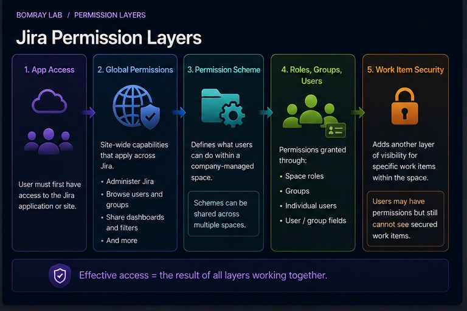
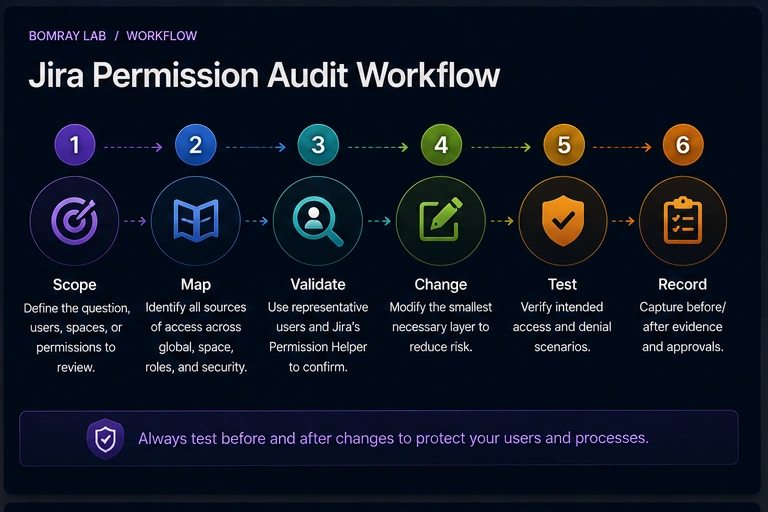
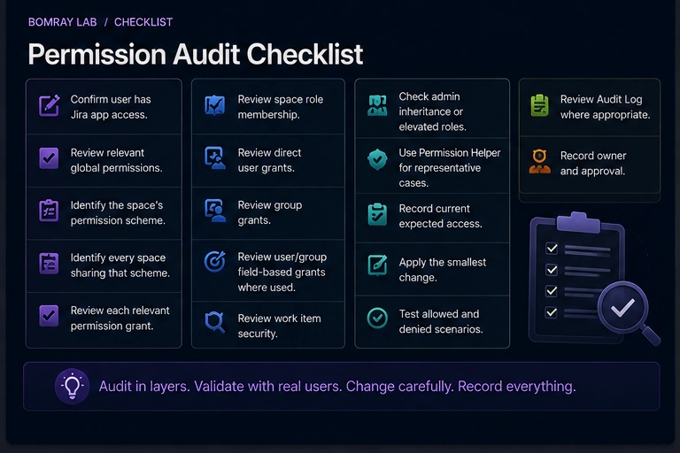

Jira permission cleanup is one of the easiest administrative tasks to underestimate.

Removing a group from one permission can look harmless until you discover that the same permission scheme is shared by several spaces, a role is populated differently in each one, or work item security is applying another layer of visibility.

A safe permission audit starts by mapping how access is granted.

> **Quick answer**
>
> Audit Jira permissions in layers: **app access → global permissions → space permission scheme → space roles/groups/users → work item security**. Before changing a shared permission scheme, identify every space that uses it and test effective access with Jira's Permission helper. Prefer role-based grants over direct user grants where the operating model allows it.

## Search Intent

People searching for **Jira permission audit**, **Jira permission scheme**, or **Jira user has access why** usually need to:

- remove excessive access;
- troubleshoot unexpected access;
- clean up old groups or users;
- standardize permission schemes;
- prepare for an audit.

The task is not just to inspect configuration. It is to determine *effective access*.

## The Jira Permission Layers

Atlassian separates permissions by scope.

### App access

A user first needs access to the Jira app/site.

### Global permissions

Global permissions apply across the Jira site. Examples include Administer Jira, Browse users and groups, Share dashboards and filters, and other site-wide capabilities.

### Permission schemes

Permission schemes define what users can do within a company-managed space.

Atlassian explicitly warns that schemes can be shared and changes apply to all spaces that use the scheme.

### Space roles, groups, and users

Permissions in schemes can be granted through roles, groups, individual users, and supported user/group fields.

### Work item security

Work item security schemes add another visibility layer for specific work items inside a space.

A user may have Browse space permission but still be unable to see a secured work item.

## Permission Audit Workflow

Use:

**Scope → Map → Validate → Change → Test → Record**

### Scope

Choose the permission, space, user population, or audit objective.

### Map

Identify every source of access.

### Validate

Use representative users and Jira's Permission helper.

### Change

Modify the smallest necessary layer.

### Test

Validate both intended access and intended denial.

### Record

Capture before/after evidence.

## Quick Permission Audit Checklist

- [ ] Confirm user has Jira app access.
- [ ] Review relevant global permissions.
- [ ] Identify the space's permission scheme.
- [ ] Identify every space sharing that scheme.
- [ ] Review each relevant permission grant.
- [ ] Review space role membership.
- [ ] Review direct user grants.
- [ ] Review group grants.
- [ ] Review user/group field-based grants where used.
- [ ] Review work item security.
- [ ] Check admin inheritance or elevated roles.
- [ ] Use Permission helper for representative cases.
- [ ] Record current expected access.
- [ ] Apply the smallest change.
- [ ] Test allowed and denied scenarios.
- [ ] Review Audit Log where appropriate.
- [ ] Record owner and approval.

## Step 1: Start With the Question You Are Trying to Answer

Permission audits become unmanageable when the scope is “review everything.”

Define a concrete question:

- Who can browse Space X?
- Why can User A edit work items?
- Which groups have global Share dashboards and filters?
- Which spaces share Permission Scheme Y?
- Can external or temporary users access sensitive work?

A focused question leads to testable evidence.

## Step 2: Separate Global and Space Permissions

Atlassian defines global permissions as site-wide capabilities.

Do not use a space permission review to infer global access.

Review global permissions separately, especially:

- Administer Jira;
- Browse users and groups;
- Share dashboards and filters;
- Make bulk changes;
- Create team-managed spaces;
- other permissions relevant to your site's operating model.

Grant global permissions sparingly because their scope is broad.

## Step 3: Identify the Permission Scheme and Its Blast Radius

For company-managed spaces, permission schemes define space capabilities.

Before editing a scheme, answer:

**How many spaces use this scheme?**

Because shared schemes apply changes to all attached spaces, a permission cleanup requested by one team can break access for another team.

If requirements differ, consider whether the spaces should use different schemes rather than adding exceptions to a shared one.

## Step 4: Understand How Permissions Are Granted

Atlassian permission schemes support grants through users, groups, and space roles, as well as supported fields.

Roles are usually easier to reuse because the scheme can reference a stable role while each space controls who belongs to that role.

This reduces the need for space-specific groups inside shared schemes.

Direct user grants can be harder to govern because they create hidden one-off access.

During an audit, flag direct grants for review—but do not remove them solely because they are direct.

## Step 5: Review Space Role Membership

A permission scheme may look clean because it grants access to a role such as Administrators or Developers.

The actual access depends on who is in that role for the specific space.

Review role membership per space.

This is especially important after:

- employee transfers;
- reorganizations;
- vendor changes;
- temporary projects;
- ownership handovers.

A clean scheme with stale role membership is still stale access.

## Step 6: Review Work Item Security

Atlassian distinguishes permission schemes from work item security schemes.

Permission schemes control access to the space and actions inside it. Work item security schemes control visibility of specific work items.

This explains a common troubleshooting pattern:

- user can browse the space;
- user can open some work items;
- user cannot see a particular secured work item.

Do not “fix” this by broadening Browse permissions if the actual restriction comes from work item security.

## Step 7: Use Permission Helper

Atlassian provides **Settings → System → Permission helper**.

The helper accepts:

- User;
- Work item;
- Permission.

It then explains the permission result.

Use it:

- before changing configuration;
- after changing configuration;
- when troubleshooting a report from a user.

Test a real work item because effective access can depend on its space and security state.

## Step 8: Audit Changes With the Audit Log

Atlassian's Jira audit log records activities including user additions/removals from spaces, groups, or roles and permission changes.

Use the audit log to support investigations such as:

- When did access change?
- Who changed a role?
- Was a permission grant recently modified?

The audit log is evidence about administrative change, not a complete replacement for current-state inspection.

## Step 9: Apply the Smallest Safe Change

Prefer:

- removing one obsolete role member instead of redesigning the entire scheme;
- narrowing one group grant instead of changing unrelated permissions;
- splitting a shared scheme only when requirements genuinely differ;
- fixing work item security rather than broadening space access.

Permission cleanup is a change-management task.

## Before and After Validation

For each change, test at least:

1. a user who should retain access;
2. a user who should lose access;
3. an administrator or process owner where relevant;
4. a secured work item if security schemes are involved.

Record the expected and observed result.

## Build an Effective Access Matrix

For sensitive or heavily governed spaces, create a small matrix before changing permissions.

| Persona | App access | Global grants | Space role/group | Work item security | Expected result |
|---|---|---|---|---|---|
| Team member | Yes | Normal | Developers | Allowed | View/edit permitted |
| Read-only stakeholder | Yes | Normal | Viewers | Allowed | View only |
| External user | Yes | Normal | Limited role | Restricted | Selected work only |
| Former team member | Yes/No | Normal | None | N/A | No space access |

The purpose is not documentation for its own sake. It gives you concrete test cases.

## Shared Permission Scheme Change Playbook

### 1. Identify all attached spaces

Do this before editing any grant.

### 2. Compare requirements

If every attached space has the same requirement, a shared scheme change may be correct.

If only one space needs the exception, splitting the scheme may be safer than adding a complicated condition that affects all spaces.

### 3. Choose the grant model

Prefer a stable role when space administrators need to manage membership independently.

Use a group when membership is centrally governed and intentionally shared across spaces.

Use direct users only when the exception is deliberate and documented.

### 4. Test with Permission helper

Select representative work items and users.

### 5. Verify negative access

A permission change is not complete when the intended user succeeds. Also test that a user who should *not* have access is denied.

## Troubleshooting Unexpected Access

When someone has more access than expected, work from broad scope to narrow scope:

1. Does the person have Jira app access?
2. Do they have elevated admin capability?
3. Which permission scheme applies?
4. Which grants satisfy the relevant permission?
5. Are they in a group indirectly?
6. Are they in a space role?
7. Is a user/group field granting permission?
8. Does work item security change the result?

When someone has less access than expected, run the same sequence but also inspect the security level on the exact work item.

Do not randomly add groups until the symptom disappears. That usually creates future excess access.

## Permission Cleanup Decision Examples

### Direct user grant left after a temporary project

The person moved teams, and the permission is now covered by a normal role.

**Decision:** Remove direct grant after validating role-based access.

### Shared scheme used by twelve spaces

One space needs stricter delete permissions.

**Decision:** Do not edit the shared scheme globally. Evaluate a separate scheme for that space.

### User can browse space but cannot open a confidential work item

Permission helper shows Browse access, but work item security excludes the user.

**Decision:** Review security scheme/level membership rather than widening Browse access.

### Group grants a global capability to many users

Only a smaller administrative population now needs it.

**Decision:** Restrict the global grant after confirming ownership and testing required workflows.

## Best Practices

### Prefer roles for reusable permission schemes

Atlassian's model is designed so shared schemes can use roles while each space manages role membership.

### Keep global permissions minimal

Site-wide capabilities have a larger blast radius.

### Review shared scheme usage before edits

Never assume a permission scheme belongs to one space.

### Test effective access, not just configuration

Permission helper turns a theoretical configuration review into a user-specific validation.

### Include role membership in offboarding

Removing app access is not the same as cleaning stale configuration references.

## Common Mistakes

### Editing a shared scheme for one team's request

The change can affect every attached space.

### Looking only at groups

Roles, direct users, and work item security can all matter.

### Granting broader access to fix one work item

The real issue may be work item security.

### Assuming admin view matches user view

Administrators often have elevated permissions that hide user-facing problems.

### Removing direct grants without an owner

Some may represent legitimate exceptions. Confirm before removal.

## FAQ

### What is the difference between global permissions and permission schemes?

Global permissions apply across the site. Permission schemes define actions within company-managed spaces.

### Can permission schemes be shared?

Yes. Atlassian states that changes to a shared scheme apply to all spaces using it.

### What is a space role?

A role is a reusable permission target. Each space can have different users or groups in the role while using the same permission scheme.

### Why can a user access a space but not one work item?

Work item security can restrict specific work items beyond the space-level permission scheme.

### What is Permission helper?

It is Jira's admin tool for checking why a specific user has or lacks a specific permission on a work item.

### Does Jira have an audit log for permission-related changes?

Yes. Jira's audit log records various user, group, role, and permission changes.

### Are permission schemes and roles available on Jira Free?

Atlassian notes limitations on Free Jira sites; space permission schemes, space roles, and work item security schemes are not available there in the same way as paid plans.

## Summary

A Jira permission audit should explain effective access, not simply list configuration.

Review:

- app access;
- global permissions;
- permission schemes;
- scheme sharing;
- role membership;
- direct user and group grants;
- work item security;
- Permission helper results;
- audit evidence.

Manual permission reviews remain an administrator responsibility. [Needs Attention for Jira](/apps/) is designed around review candidates rather than automatic permission changes, so final access decisions stay with administrators.

## Official References

- <a href="https://support.atlassian.com/jira-cloud-administration/docs/manage-permissions-in-jira-cloud/" target="_blank" rel="noopener noreferrer">Manage permissions in Jira Cloud — Atlassian Support</a>
- <a href="https://support.atlassian.com/jira-cloud-administration/docs/what-are-global-permissions-and-what-do-they-do/" target="_blank" rel="noopener noreferrer">What are global permissions? — Atlassian Support</a>
- <a href="https://support.atlassian.com/jira-cloud-administration/docs/what-are-permission-schemes-in-jira/" target="_blank" rel="noopener noreferrer">What are permission schemes in Jira? — Atlassian Support</a>
- <a href="https://support.atlassian.com/jira-cloud-administration/docs/manage-project-role-membership/" target="_blank" rel="noopener noreferrer">How to use space roles — Atlassian Support</a>
- <a href="https://support.atlassian.com/jira-cloud-administration/docs/what-are-work-item-security-schemes/" target="_blank" rel="noopener noreferrer">What are work item security schemes? — Atlassian Support</a>
- <a href="https://support.atlassian.com/jira-cloud-administration/docs/check-a-users-access-from-a-work-item/" target="_blank" rel="noopener noreferrer">Check a user's access from a work item — Atlassian Support</a>
- <a href="https://support.atlassian.com/jira-cloud-administration/docs/audit-activities-in-jira-applications/" target="_blank" rel="noopener noreferrer">Audit activities in Jira — Atlassian Support</a>
