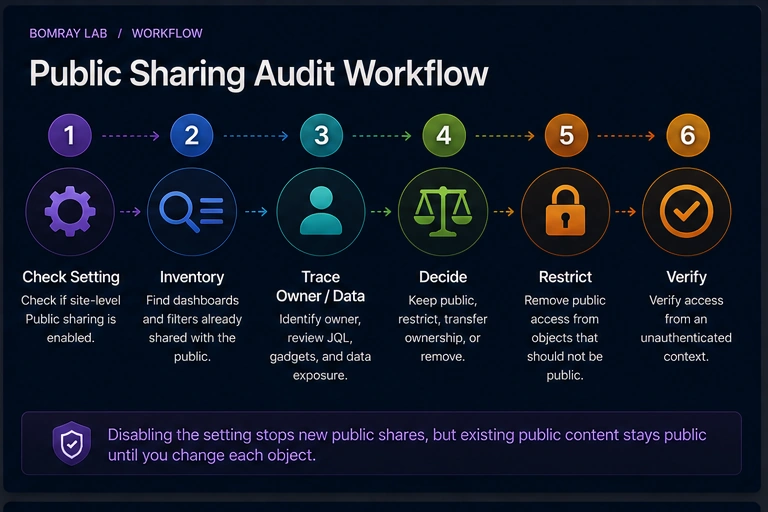
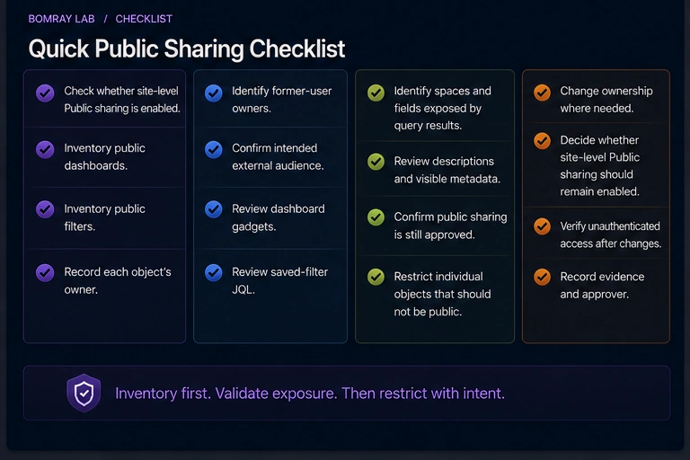
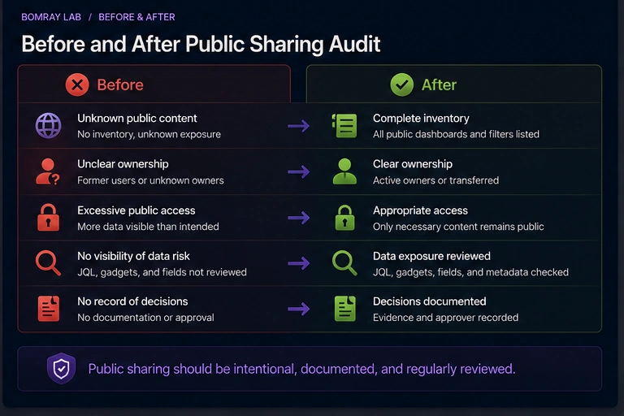

Public sharing in Jira Cloud deserves its own audit.

A dashboard or saved filter can be intentionally shared with people who are not logged in. That may be valid for some organizations, but it creates a different exposure model from normal authenticated Jira sharing.

The most important operational detail is easy to miss: **turning Public sharing off does not automatically make already-public dashboards and filters private.**

> **Quick answer**
>
> Audit public sharing in two layers. First, review the site-level setting that allows future public shares. Second, separately inventory dashboards and filters already marked **Shared with the public**. For every public object, confirm owner, purpose, underlying filter/JQL, visible data, intended audience, and approval before keeping or restricting it.

## Search Intent

Searchers looking for **Jira public dashboard**, **Jira public filters**, or **disable Jira public sharing** usually want to know:

- whether Jira content is visible without login;
- how to find public objects;
- whether disabling the setting removes existing public access;
- how to clean up exposure.

This article is an exposure-audit guide, not a generic dashboard cleanup guide.

## How Public Sharing Works

Atlassian's current Jira Cloud documentation states:

- Standard, Premium, and Enterprise sites can support public filter/dashboard sharing;
- Free Jira sites cannot be opened to public sharing in this way;
- a Jira administrator must allow Public sharing at site level before users can create public shares;
- turning the setting on does not automatically publish content;
- turning it off prevents new or not-yet-public shares, but does not restrict content already public.

That last point is why the audit needs both policy and content review.

## Public Sharing Audit Workflow

Use:

**Check Setting → Inventory Public Objects → Trace Owner/Data → Decide → Restrict → Verify**

### Check setting

Determine whether users are currently allowed to create public dashboard/filter shares.

### Inventory public objects

Use Jira administration to locate objects marked public.

### Trace owner and data

Understand who owns the object and what anonymous viewers can infer.

### Decide

Keep public, restrict, transfer, or remove.

### Restrict

Change the individual object's viewer permissions if it should no longer be public.

### Verify

Test the final state from an unauthenticated context where appropriate.

## Quick Public Sharing Checklist

- [ ] Check whether site-level Public sharing is enabled.
- [ ] Inventory public dashboards.
- [ ] Inventory public filters.
- [ ] Record each object's owner.
- [ ] Identify former-user owners.
- [ ] Confirm intended external audience.
- [ ] Review dashboard gadgets.
- [ ] Review saved-filter JQL.
- [ ] Identify spaces and fields exposed by query results.
- [ ] Review descriptions and visible metadata.
- [ ] Confirm public sharing is still approved.
- [ ] Restrict individual objects that should not be public.
- [ ] Change ownership where needed.
- [ ] Decide whether site-level Public sharing should remain enabled.
- [ ] Verify unauthenticated access after changes.
- [ ] Record evidence and approver.

## Step 1: Check the Site-Level Setting

Atlassian documents the setting under Jira System general configuration.

If Public sharing is on, permitted users can make dashboards and filters publicly accessible.

This is a **capability control**, not an inventory of current exposure.

Record:

- current setting;
- business reason;
- approval owner;
- review date.

If the organization has no legitimate public-sharing use case, consider turning it off after reviewing existing public content.

## Step 2: Inventory Existing Public Dashboards and Filters

Atlassian provides an administrator view:

**Settings → System → Filters** or **Dashboards**

Public items are marked **Shared with the public**.

Create an inventory with:

| Object | ID | Type | Owner | Purpose | Public approved? |
|---|---|---|---|---|---|
| Weekly status | 10001 | Dashboard | User A | External status | Yes/No |
| Open incidents | 10002 | Filter | Former user | Unknown | Investigate |

Do not rely on the global setting to tell you whether content is already public.

## Step 3: Understand What “Public” Means

Atlassian defines public sharing as sharing with people who are not logged in to your Jira Cloud site.

For filters, Atlassian warns that publicly shared filters can be visible and searchable on the internet.

That makes public sharing fundamentally different from sharing with:

- a user;
- a group;
- a space;
- logged-in Jira users.

Review public exposure as an external-publishing decision.

## Step 4: Review Public Filters First

Filters frequently sit under dashboards.

For each public filter:

- run the JQL;
- inspect result columns and values;
- review project/space scope;
- review field references;
- confirm whether result visibility is appropriate;
- identify dashboards or boards that depend on it;
- confirm owner.

A public filter can expose more than the owner intended if the JQL broadens over time as new projects or values are added.

## Step 5: Review Public Dashboards

For each dashboard:

- record owner;
- list gadgets;
- trace saved filters;
- review descriptions and titles;
- confirm intended external audience;
- determine whether the content is still accurate.

A dashboard can be correctly shared while one underlying filter is too broad.

Audit both layers.

## Step 6: Handle Former Owners

If an owner is a former user, Jira administrators can manage shared filters and dashboards from the shared-items administration area.

Do not simply change ownership to the Jira administrator and keep the object public.

First decide whether the organization still wants the external publication.

Then assign a current accountable owner if the object remains valid.

## Step 7: Restrict Existing Public Objects Individually

This is the key operational step.

Atlassian explicitly states that turning Public sharing off does **not** restrict filters and dashboards that are already shared publicly.

Therefore the cleanup sequence should be:

1. inventory existing public objects;
2. update viewer permissions on objects that should no longer be public;
3. verify access;
4. decide whether to disable the site-level capability for future shares.

This prevents a false sense of security.

## Step 8: Decide Keep Public vs Restrict

### Keep public

Only when:

- business purpose is current;
- owner is accountable;
- content is intentionally suitable for anonymous viewing;
- underlying filters are reviewed;
- approval is recorded.

### Restrict

Use when external visibility is unnecessary or excessive.

### Transfer

Use when content remains valid but ownership is stale.

### Remove

Use when the object itself is obsolete, after dependency review.

### Investigate

Use when purpose or exposure is unclear.

## Build a Public Exposure Register

For public objects, record more than the name.

| Evidence | Why collect it |
|---|---|
| Object ID | Stable reference |
| Type | Filter or dashboard |
| Owner | Accountability |
| Public viewer state | Confirms exposure |
| Business purpose | Explains why public is needed |
| JQL / gadgets | Identifies actual data |
| Referenced spaces | Defines scope |
| Sensitive fields | Highlights review areas |
| Approval owner | Confirms business decision |
| Review date | Prevents permanent accidental exposure |

A public object should have an explicit reason to remain public.

## What to Look For in Public JQL

Public filter review should consider how the query can evolve.

For example:

`project in (ABC, XYZ)`

has a relatively explicit scope.

A broad query based on shared labels or field values can unintentionally include future work from new spaces if those values are reused.

Ask:

- Is the space scope explicit?
- Are new work types automatically included?
- Could new values broaden results?
- Are result columns appropriate?
- Does the filter description disclose internal terminology?

Review future behavior, not only today's result set.

## Verification Without Login

When your security policy permits testing, validate the final public state from an unauthenticated browser context.

For a kept-public object, confirm that only the intended content is visible.

For a restricted object, confirm that the public URL no longer provides the prior anonymous view.

Do not test only with an administrator session. Your authenticated permissions are not representative of public access.

## Public Sharing Decision Examples

### Intentional public status dashboard

The dashboard is approved for customers, contains deliberately public metrics, has a current owner, and all underlying filters are reviewed.

**Decision:** Keep public and set a review date.

### Old recruitment dashboard

The campaign ended months ago. The dashboard remains public because nobody revisited it.

**Decision:** Restrict or remove after owner confirmation.

### Former-user public filter

The query is still used internally, but external exposure is no longer justified.

**Decision:** Restrict public access, then transfer ownership if the internal filter remains useful.

### Unknown public object

Nobody can identify why it is public, but it contains current operational data.

**Decision:** Investigate urgently and restrict according to your organization's risk policy rather than assuming historical intent is approval.

## Audit Cadence

The right cadence depends on risk, but public objects deserve more frequent review than ordinary internal artifacts.

Trigger reviews when:

- a user with public objects leaves;
- site Public sharing policy changes;
- a migration changes space keys or data scope;
- a public-facing initiative ends;
- sensitive field design changes;
- a new integration or app changes dashboard content.

The review should answer whether the public purpose is still current—not merely whether the URL still works.

## Record the Reason for Every Public Exception

If Public sharing remains enabled, document why specific content is allowed to stay public. A useful exception record identifies the business owner, external audience, information being published, approval date, and next review date.

This makes future audits much easier. The question becomes “Is this approved public use still valid?” rather than “Does anyone remember why this dashboard is on the internet?”

A public exception should also define what would trigger immediate re-review: ownership change, space migration, new sensitive fields, major JQL changes, or the end of the external-facing initiative. Trigger-based review prevents a once-valid public share from becoming permanent by inertia.

## Best Practices

### Treat public content as publishing

Apply a higher review bar than internal sharing.

### Review filters and dashboards together

Dashboard exposure can be determined by underlying query design.

### Separate policy from current exposure

The site toggle controls capability; object permissions control existing exposure.

### Assign an accountable owner

Public content should never rely on an unowned former-user configuration.

### Re-audit after organizational changes

Migrations, acquisitions, app changes, and team restructuring can alter exposure.

## Common Mistakes

### Turning Public sharing off and assuming the site is clean

Already-public content remains public.

### Auditing dashboards but not filters

A saved filter can itself be public and can also feed dashboards.

### Keeping a public object because “it has always been public”

Historical configuration is not current approval.

### Testing while logged in

Authenticated access can hide the actual anonymous experience.

### Transferring former-user ownership without reviewing exposure

Ownership and sharing are separate decisions.

## Before and After

| Before | After |
|---|---|
| Public-sharing toggle assumed sufficient | Existing public objects inventoried |
| Former owner | Current accountable owner |
| Public JQL unreviewed | Query scope validated |
| Anonymous visibility unknown | Exposure explicitly tested |
| No approval record | Public purpose and approver documented |

## FAQ

### Can Jira filters and dashboards be shared publicly?

Yes on supported Jira Cloud plans when a Jira administrator enables Public sharing.

### Can Free Jira sites enable this public sharing?

Atlassian currently states that Free Jira sites cannot be opened to the public using this dashboard/filter Public sharing feature.

### Does enabling Public sharing automatically make dashboards public?

No. It enables the capability; individual objects still need public sharing configured.

### Does disabling Public sharing make existing public content private?

No. Existing public dashboards and filters must be updated separately.

### How do administrators find public dashboards and filters?

Use Settings → System → Filters or Dashboards and look for **Shared with the public**.

### Can a public filter be searchable on the internet?

Atlassian warns that publicly shared filters can be visible and searchable on the internet.

### Should public content have a named owner?

Yes. Public exposure should have current business accountability.

## Summary

A Jira public-sharing audit has two different controls:

1. **Can users create public shares?**
2. **What is already public?**

Review both.

Inventory existing public filters and dashboards, trace ownership and query scope, restrict objects individually when needed, verify anonymous access, and then decide whether the site-level capability should remain enabled.

[Needs Attention for Jira](/apps/) can support evidence collection around review candidates, while public exposure decisions remain with Jira administrators and the business owners responsible for the content.

## Official References

- <a href="https://support.atlassian.com/jira-cloud-administration/docs/allow-dashboards-and-filters-in-your-site-to-be-shared-publicly/" target="_blank" rel="noopener noreferrer">Allow dashboards and filters to be shared publicly — Atlassian Support</a>
- <a href="https://support.atlassian.com/jira-cloud-administration/docs/view-which-filters-and-dashboards-are-shared-publicly-in-your-site/" target="_blank" rel="noopener noreferrer">View which filters and dashboards are shared publicly — Atlassian Support</a>
- <a href="https://support.atlassian.com/jira-cloud-administration/docs/manage-shared-filters/" target="_blank" rel="noopener noreferrer">Manage filters — Atlassian Support</a>
- <a href="https://support.atlassian.com/jira-cloud-administration/docs/manage-shared-dashboards/" target="_blank" rel="noopener noreferrer">Manage dashboards — Atlassian Support</a>
- <a href="https://support.atlassian.com/jira/kb/how-to-share-a-dashboard-or-filter-ie-make-it-public-change-its-viewers-and-editor-permissions/" target="_blank" rel="noopener noreferrer">Share dashboards or filters: viewers and editors — Atlassian Support</a>
