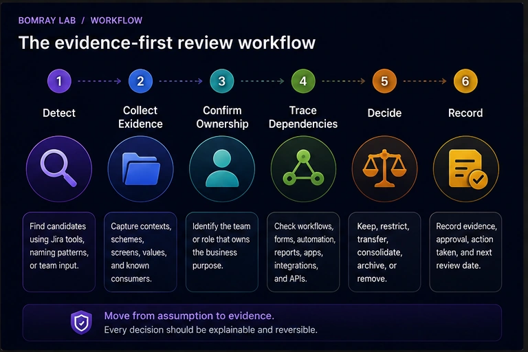
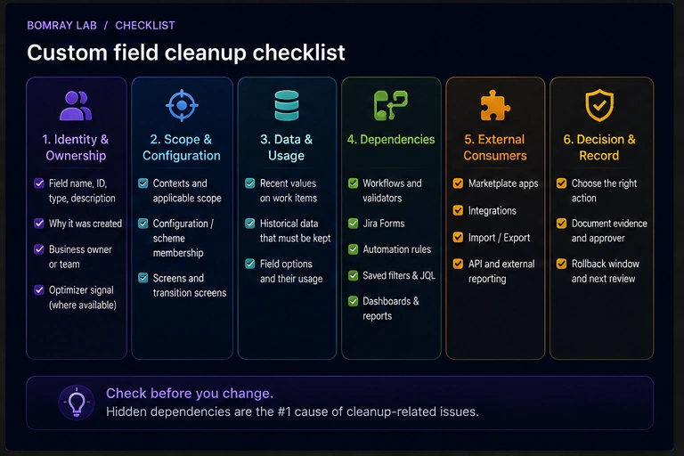
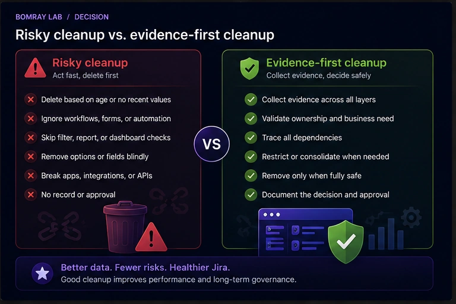

Custom fields accumulate for understandable reasons: migrations, temporary projects, duplicated requirements, app installations, experiments, and teams solving the same problem in different ways. Years later, a Jira administrator may have hundreds of fields with unclear purpose.

The difficult part is not finding fields that *look* unused. It is proving that changing them will not break data entry, workflows, automation, forms, reports, integrations, or historical records.

> **Quick answer**
>
> Treat “unused” as a review status, not a deletion instruction. Start with Jira's own optimization signals where available, then verify recent values, field contexts, screens or field schemes, workflows, forms, automation, app/integration dependencies, and reporting use. Prefer **Restrict** or **Consolidate** when the field still has a valid purpose; use **Remove** only when the evidence and owner approval support it.

## Search Intent

Administrators searching for **Jira unused custom fields**, **Jira custom field cleanup**, or **how to delete custom fields in Jira** usually need to answer three questions:

1. Which fields are realistic cleanup candidates?
2. How can I tell whether a field is actually unused?
3. What must I check before removing it?

This guide focuses on that decision process for Jira Cloud. It is not a recommendation to bulk-delete old fields.

## Why Custom Field Cleanup Matters

Custom fields are part of Jira's configuration model, not isolated columns.

A field can be scoped by context, included in field configurations or schemes, placed on screens, referenced by workflows, used in forms, populated on work items, queried in JQL, consumed by dashboards or reports, or referenced by automation and apps.

That means a field can appear quiet while still being structurally important.

Atlassian has also introduced field-management limits and optimization tools for Jira Cloud. Current documentation describes a 700-field limit for field configurations and tools that identify fields that can be removed from schemes or, on supported plans, from the site. Atlassian's scheme optimizer uses more than “no recent values”: its unused-field criteria also exclude fields associated with screens or schemes, workflows, Forms, and fields created or used by Jira or apps.

The operational lesson is simple: **low data activity is evidence, not proof.**

## The Evidence-First Workflow

Use this sequence for every candidate:

**Detect → Collect Evidence → Confirm Ownership → Trace Dependencies → Decide → Record**

### 1. Detect

Build a candidate list from Jira's optimization tools, naming patterns, known migrations, duplicate fields, broad contexts, or fields reported by teams as obsolete.

### 2. Collect Evidence

Capture the field ID, name, type, contexts, applicable projects and work types, configuration/scheme membership, screens, values, options, and known consumers.

### 3. Confirm Ownership

Find the team or role that understands why the field exists. If nobody can identify an owner, mark it **Investigate** rather than assuming it is safe to delete.

### 4. Trace Dependencies

Check workflows, Forms, automation, saved filters and JQL, dashboards, reports, Marketplace apps, integrations, imports/exports, and API consumers.

### 5. Decide

Choose **Keep, Restrict, Transfer, Consolidate, Archive, Remove, or Investigate**. For custom fields, “Transfer” normally means transferring governance responsibility rather than changing a Jira field-owner property.

### 6. Record

Record the evidence, decision, approver, change performed, rollback window, and next review date.

## Quick Custom Field Cleanup Checklist

- [ ] Record the field name, ID, type, and description.
- [ ] Identify why the field was created and who owns the business requirement.
- [ ] Check Jira's optimizer signal where available.
- [ ] Review contexts and applicable projects/work types.
- [ ] Review field configuration or field scheme membership.
- [ ] Review screens and transition screens.
- [ ] Check whether work items contain historical or recent values.
- [ ] Check workflows and advanced workflow functions.
- [ ] Check Jira Forms.
- [ ] Search automation rules for field references.
- [ ] Search saved filters and important JQL.
- [ ] Check dashboards and reports that depend on those filters.
- [ ] Check Marketplace apps and integrations.
- [ ] Check API, import, export, and external reporting dependencies.
- [ ] Review field options separately from the field itself.
- [ ] Look for duplicate fields serving the same business concept.
- [ ] Confirm the target field before consolidating data.
- [ ] Choose Keep, Restrict, Consolidate, Remove, or Investigate.
- [ ] Record approval and rollback information.
- [ ] Revalidate after the change.

## Step 1: Start With Jira's Own Optimization Signals

Jira Cloud now provides useful first-party signals, but administrators need to understand exactly what each tool means.

### Site optimizer

Atlassian documents the **Site optimizer → Custom fields** experience for Premium and Enterprise Jira plans. Its site-level unused-fields view identifies eligible global custom fields that are not associated with a company-managed space or screen. Atlassian describes this as a cleanup aid, not a replacement for administrative review.

### Field configuration scheme optimization

Jira also documents **Optimize scheme** for field configuration schemes on Free, Standard, Premium, and Enterprise plans.

For this tool, a field is considered unused only when all documented conditions are satisfied, including:

- it has not been used on a work item in the last two years;
- it is not associated with a screen or scheme;
- it was created by a Jira administrator rather than Jira or an app;
- it is not used in workflows;
- it is not used in Forms.

This is a much stronger candidate signal than “I haven't seen this field lately,” but it still tells you what Jira detected under its criteria. Your organization may have dependencies outside that detection boundary.

Use optimizer output to **prioritize review**, not to skip it.

## Step 2: Identify the Field Precisely

Never review custom fields by display name alone.

Jira sites often contain fields with identical or nearly identical names. Before collecting evidence, record:

| Evidence | Why it matters |
|---|---|
| Field name | Human-readable reference |
| Field ID | Distinguishes duplicates |
| Field type | Determines data and option behavior |
| Description | May reveal original purpose |
| Contexts | Defines where variants of the field apply |
| Projects/work types | Establishes current scope |
| Field scheme/configuration | Shows structural association |
| Screens | Shows lifecycle entry points |
| Historical values | Shows stored business data |
| Options | May require separate cleanup |

If two fields are both called “Customer Tier,” the field ID is what prevents you from reviewing or deleting the wrong object.

## Step 3: Review Contexts Before Calling a Field Global or Unused

Atlassian defines a field context as the configuration that determines where a field variant appears and can also provide different defaults, options, or user restrictions.

By default, a field context can apply broadly. Administrators can narrow contexts by project/space and work type.

This creates an important cleanup opportunity: a field may be valid but scoped far more broadly than necessary.

Before deletion, ask:

- Does the field need to exist everywhere its current context allows?
- Could the context be restricted to the projects that actually use it?
- Are multiple contexts intentionally providing different options or defaults?
- Would editing the context affect projects that share it?

Atlassian warns that modifying a context affects all projects/spaces and work types that use that context. Context cleanup therefore deserves the same dependency discipline as field deletion.

**Restrict** is often safer and more useful than **Remove**.

## Step 4: Check Field Schemes, Configurations, and Screens

A field's presence in configuration is separate evidence from whether users have populated it recently.

Current Jira Cloud documentation is transitioning from field configurations and field configuration schemes toward a unified field-schemes experience, so the exact administration labels can differ by site during rollout.

Review whichever configuration model your site currently exposes.

Also inspect screens. Atlassian describes screens as a way to choose which fields appear at specific stages, especially creation and workflow transitions.

A field on a transition screen may be important even if values are infrequent. For example, an escalation field used only during a rare incident workflow may legitimately have low activity.

Do not equate low frequency with low importance.

## Step 5: Check Stored Values — but Use the Result Correctly

Historical and recent values are important evidence.

For a candidate field, determine:

- whether any work items contain a value;
- whether values have appeared recently;
- which projects and work types contain them;
- whether the values are needed for historical reporting;
- whether another field now captures the same concept.

A field with no values is a stronger cleanup candidate than one with years of historical data, but even an empty field can be referenced by configuration or external systems.

Conversely, historical values do not automatically mean the field must remain active forever. You may be able to remove it from active schemes or screens while preserving data, depending on the action you take.

Atlassian's scheme optimizer specifically notes that removing an unused field from a field configuration scheme does **not** delete field data from work items; the values become inaccessible through that scheme until the field is re-associated.

That is very different from deleting the field itself.

## Step 6: Trace Workflow and Form Dependencies

Before changing a candidate field, inspect workflows that apply to its projects.

Look for:

- transition screens;
- conditions or validators;
- post-functions or advanced workflow functions;
- rules that require or update the field;
- workflow logic provided by apps.

Also check Jira Forms. Atlassian explicitly includes Forms usage in its scheme optimizer criteria, which is a good reminder that a field may be important even when it is not obvious from a normal work-item view.

A rare workflow path or form can explain why a field appears inactive.

## Step 7: Search Automation, JQL, Filters, Dashboards, and Reports

This is where manual cleanup often becomes time-consuming.

A field may be referenced by:

- Jira automation conditions or actions;
- JQL in saved filters;
- subscriptions;
- dashboards that use those filters;
- reports;
- queues;
- boards;
- documentation containing reusable JQL;
- scripts or integration configuration.

Search by **field name and field ID** where the consuming system supports it.

Duplicate names make name-only searches unreliable. A saved filter may also be business-critical even when nobody remembers the field itself.

If a field is used in reporting but no longer in data entry, the right action may be to **Restrict** its active scope while retaining the reporting dependency.

## Step 8: Check Apps, Integrations, and APIs

Do not assume Jira's native configuration views reveal every dependency.

A custom field can be consumed by:

- Forge, Connect, or other Marketplace apps;
- synchronization tools;
- data warehouses;
- BI pipelines;
- webhook consumers;
- REST API clients;
- CSV imports and exports;
- internal scripts.

Atlassian's deletion documentation is especially relevant here: when a field is deleted, it is tagged for deletion for 60 days and removed from automations, advanced workflow functions, and third-party apps that use it. For company-managed fields, it also stops appearing in field screens and configurations.

That is why deletion should come **after** dependency review, not before it.

## Step 9: Review Field Options Separately

Sometimes the field is healthy but its option list is not.

Select lists, cascading selects, and checkboxes can accumulate obsolete values after reorganizations, imports, or integrations.

Atlassian provides a separate **Optimize** experience for field options on Free, Standard, Premium, and Enterprise plans. Its documented unused-option criteria include options not referenced by work items or workflows for the relevant period and exclude newly created options.

This gives administrators another decision:

**Do we need to remove the field, or only clean up its options?**

If the field still represents a valid business concept, option cleanup is usually the less disruptive action.

## Step 10: Detect Duplicate Fields Before Deleting Either One

Duplicate fields deserve a consolidation review.

Common examples include:

- `Customer Type` and `Customer Category`;
- `Region` and `Sales Region`;
- `Target Date` and `Expected Date`;
- fields recreated during migration;
- fields created independently by different teams.

Do not consolidate based on similar names.

Compare:

- field type;
- contexts;
- option sets;
- projects and work types;
- data semantics;
- workflow references;
- automation;
- JQL and reporting;
- integrations;
- historical values.

If they truly represent the same concept, choose a canonical field and plan the migration. The cleanup action comes after the data and dependency migration, not before.

Atlassian's context model can also reduce unnecessary duplication: one field can use different contexts and option sets for different teams while keeping reporting on the same underlying field.

## Step 11: Choose the Correct Outcome

| Outcome | Use when |
|---|---|
| **Keep** | The field has a valid purpose, appropriate scope, and active dependencies. |
| **Restrict** | The field is valid but its context, scheme, screen, or availability is broader than necessary. |
| **Transfer** | Governance responsibility needs to move to a current team or role. |
| **Consolidate** | Another field represents the same business concept and dependencies can be migrated safely. |
| **Archive** | Your organization needs a retention state before removal. Jira custom fields do not provide a generic “archive field” action, so define this operationally—for example, removing the field from active configuration while retaining required historical data. |
| **Remove** | The field is genuinely unnecessary, dependencies are understood, and removal is approved. |
| **Investigate** | Purpose, data, ownership, or dependencies remain unclear. |

The decision should be based on the whole evidence set, not a single threshold.

## Step 12: Understand What Delete Actually Does

Deletion is materially different from removing a field from a scheme or screen.

According to Atlassian's current Jira Cloud documentation:

- deleting a field does not permanently erase it immediately;
- the field is tagged for deletion in **60 days**;
- it is removed from automations, advanced workflow functions, and third-party apps that use it;
- company-managed fields are removed from field screens and configurations;
- before permanent deletion, an administrator can restore it from **Deleted fields**;
- restoring re-adds it to the places where it was used along with its data.

If historical field data must be retained independently, Atlassian recommends backing up the Jira site.

The 60-day recovery period is useful, but it should be treated as rollback protection—not as permission to skip dependency analysis.

## Best Practices

### Prefer reducing scope before deleting

If a field is needed by two projects but globally available, narrowing its context or active configuration can reduce clutter without destroying a valid object.

### Use field IDs in the review record

Names change and duplicates exist. The ID should be the stable reference in approvals and cleanup logs.

### Separate “no recent values” from “no dependencies”

These are different claims. A field can have no recent values and still be required by a workflow, form, automation rule, app, or report.

### Review configuration and business ownership together

Technical dependency checks tell you where a field is connected. A business owner tells you why those connections exist and whether they are still needed.

### Consolidate before deleting duplicates

Select the canonical field, migrate data and dependencies, validate users and reports, and only then remove the redundant field.

### Keep an evidence record

For each reviewed field, store the evidence date, owner, dependencies checked, decision, approver, action, and rollback information.

### Re-scan after major changes

Imports, migrations, app changes, reorganizations, and workflow redesigns can change field usage. Atlassian's optimizer tools also provide refresh or update-scan actions where applicable.

## Common Mistakes

### Deleting a field because it has no recent values

Low activity may be normal for annual processes, escalation paths, audit workflows, or rare incident types.

### Deleting every field reported by an optimizer

Optimizer output is excellent candidate detection. Your external integrations and organization-specific reporting still need review.

### Checking screens but ignoring contexts

A field's context can determine which projects and work types it applies to. Screen membership is not the whole scope.

### Checking values but ignoring workflows and Forms

A field can support process logic even when users rarely populate it directly.

### Treating duplicate names as duplicate meaning

Two similarly named fields can have different types, contexts, owners, or reporting semantics.

### Deleting the field when only its options are stale

Field-option optimization can solve clutter without removing the field itself.

### Assuming the 60-day deletion window makes cleanup risk-free

Deletion immediately affects configurations and consumers even though permanent deletion is delayed. Recovery is a fallback, not a substitute for validation.

## Before and After: A Better Custom Field Cleanup

A weak cleanup produces a shorter field list.

A strong cleanup produces a configuration that teams can understand and maintain.

| Before | After |
|---|---|
| Candidate chosen because it “looks old” | Candidate backed by optimizer and usage evidence |
| Field reviewed by name only | Field ID recorded and duplicates distinguished |
| Global context left untouched | Context limited to legitimate projects/work types |
| Screens checked in isolation | Schemes, screens, workflows, Forms, and values reviewed |
| No recent values = delete | Recent values and dependency evidence evaluated separately |
| Duplicate fields deleted ad hoc | Canonical field chosen and dependencies migrated |
| Apps and APIs assumed safe | External consumers explicitly checked |
| Delete is the default action | Keep, Restrict, Consolidate, Remove, or Investigate chosen deliberately |
| No audit trail | Evidence, approval, action, and rollback recorded |

## FAQ

### How does Jira decide that a custom field is unused?

It depends on the optimization tool. Atlassian's field configuration scheme optimizer uses documented criteria including no work-item use in the last two years, no screen or scheme association, no workflow or Forms use, and administrator-created rather than Jira/app-created fields. The Premium/Enterprise Site optimizer has its own site-level criteria for unused global custom fields. Always interpret the result in the context of the specific tool.

### Is a field with no values safe to delete?

Not automatically. It may still be referenced by workflows, Forms, automation, JQL, apps, integrations, or APIs.

### Should I delete a custom field or remove it from a screen?

They solve different problems. Removing a field from a screen changes where users encounter it. Removing it from a field scheme/configuration changes its active configuration. Deleting the field starts Jira's field-deletion process and affects its consumers much more broadly.

### Can I restore a deleted Jira custom field?

Yes, during Jira Cloud's deletion window. Atlassian currently documents a 60-day period before permanent deletion, with restoration available from the Deleted fields tab.

### Does restoring a deleted field restore its data?

Atlassian states that restoring the field re-adds it to the places where it was used along with its data.

### Can I use Jira's Site optimizer on every plan?

No. Atlassian currently documents the custom-field Site optimizer capability for Premium and Enterprise Jira plans. Some scheme and field-option optimization capabilities are available across Free, Standard, Premium, and Enterprise.

### What if the field is valid but available in too many projects?

Review and narrow its context or configuration rather than deleting it. Contexts are designed to control where field variants apply.

### What if two custom fields do the same thing?

Confirm that they truly have the same business meaning, then select a canonical field and migrate values and dependencies. Delete the redundant field only after validation.

### Should Jira administrators own every custom field?

Jira does not use a dashboard-style ownership model for administrator-created custom fields. For governance, however, every important field should have a known business or configuration owner in your administrative records.

### How often should custom fields be reviewed?

Use a regular cadence for large or fast-changing Jira sites and trigger additional reviews after migrations, app removals, reorganizations, major workflow changes, and large imports. The cadence should reflect how quickly your configuration changes.

## Summary

Finding unused Jira custom fields is a detection problem. Removing them safely is a dependency problem.

A reliable review should answer:

- What exactly is this field?
- Why does it exist?
- Where does its context apply?
- Which schemes and screens include it?
- Does it contain historical or recent data?
- Do workflows or Forms depend on it?
- Do automation, JQL, dashboards, reports, apps, integrations, or APIs reference it?
- Is the field obsolete, or merely too broadly scoped?
- Is there a duplicate field that should be consolidated?
- Who approves the final action?

Manual review is practical for smaller Jira sites. As the number of projects, fields, and dependencies grows, collecting the evidence becomes the expensive part. [Needs Attention for Jira](/apps/) can help surface custom fields that deserve review while leaving the final Keep, Restrict, Consolidate, or Remove decision with Jira administrators.

## Official References

- <a href="https://support.atlassian.com/jira-cloud-administration/docs/optimize-your-custom-fields/" target="_blank" rel="noopener noreferrer">Optimize fields in your site — Atlassian Support</a>
- <a href="https://support.atlassian.com/jira-cloud-administration/docs/optimize-fields-in-your-project/" target="_blank" rel="noopener noreferrer">Optimize field configuration schemes — Atlassian Support</a>
- <a href="https://support.atlassian.com/jira-cloud-administration/docs/delete-or-restore-a-field/" target="_blank" rel="noopener noreferrer">Delete or restore a field — Atlassian Support</a>
- <a href="https://support.atlassian.com/jira-cloud-administration/docs/what-are-field-contexts/" target="_blank" rel="noopener noreferrer">What are field contexts? — Atlassian Support</a>
- <a href="https://support.atlassian.com/jira-cloud-administration/docs/view-a-field-context-and-how-its-set-up/" target="_blank" rel="noopener noreferrer">View a field context and how it's set up — Atlassian Support</a>
- <a href="https://support.atlassian.com/jira-cloud-administration/docs/edit-a-custom-field-context/" target="_blank" rel="noopener noreferrer">Create a field context and define where it's used — Atlassian Support</a>
- <a href="https://support.atlassian.com/jira-cloud-administration/docs/optimize-field-options/" target="_blank" rel="noopener noreferrer">Optimize field options — Atlassian Support</a>
- <a href="https://support.atlassian.com/jira-cloud-administration/docs/find-your-custom-fields/" target="_blank" rel="noopener noreferrer">Find missing fields in your spaces and work items — Atlassian Support</a>
- <a href="https://support.atlassian.com/jira-cloud-administration/docs/add-a-custom-field-to-a-screen" target="_blank" rel="noopener noreferrer">Create and set up work item screens — Atlassian Support</a>
