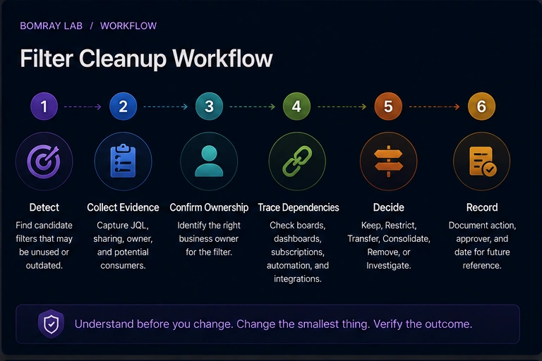
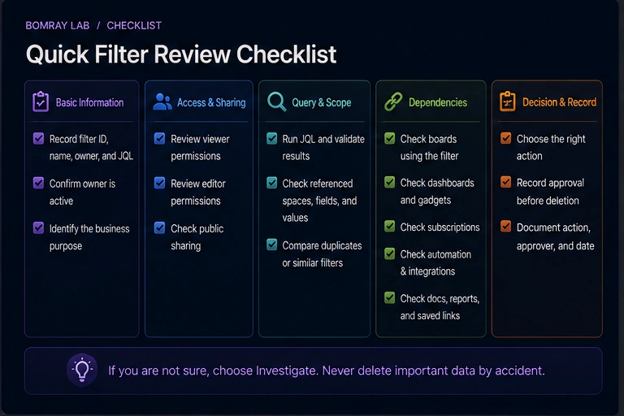
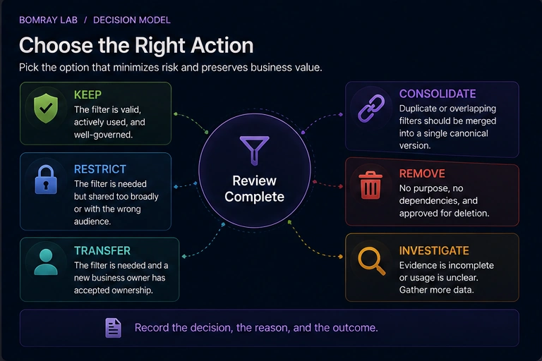

Saved filters are deceptively small Jira objects. A filter may look like one person's old search, but it can also be the data source for a board, dashboard gadget, subscription, or operational report.

That is why filter cleanup should start with dependency tracing, not deletion.

> **Quick answer**
>
> Build a candidate list from stale ownership, duplicate JQL, obsolete names, or confirmed business changes. Then verify the filter owner, sharing, JQL, board dependencies, dashboards, subscriptions, automation or integrations, and public visibility. Choose **Keep, Restrict, Transfer, Consolidate, Remove, or Investigate** only after the dependency chain is clear.

## Search Intent

Searchers using **Jira unused filters**, **Jira filter cleanup**, **delete Jira filter**, or **change filter owner Jira** usually want to reduce clutter or repair filters left behind by former users.

The administrator must answer:

- Is the filter still used?
- Does a board depend on it?
- Is it shared too broadly?
- Can ownership be transferred?
- Is deletion safe?

## Why Saved Filters Become Operational Dependencies

A saved filter is a saved work-item search. Its owner controls the search criteria and sharing.

That alone is important, but filters also sit underneath other Jira features.

A company-managed board can be created from a saved filter. Dashboard gadgets can use saved filters. Users can subscribe to filters. A filter can also be reused as a reference point for reports or external processes.

Atlassian documents cases where a board becomes inaccessible because of its filter's ownership or permissions. That makes filter governance more than housekeeping.

## Filter Cleanup Workflow

Use:

**Detect → Collect Evidence → Confirm Ownership → Trace Dependencies → Decide → Record**

### Detect

Candidates include:

- owner is a former or deactivated user;
- duplicate or nearly identical JQL;
- obsolete project/space keys;
- broken JQL;
- broad or public sharing that is no longer appropriate;
- known temporary reports;
- owner-confirmed obsolete filters.

### Collect evidence

Record:

- filter ID and name;
- owner;
- JQL;
- viewers and editors;
- public sharing;
- board dependencies;
- dashboard dependencies;
- subscriptions;
- reporting or integration use.

### Confirm ownership

If the current owner is inactive, find the team that owns the underlying business query.

### Trace dependencies

Do not stop at “Can I run the JQL?”

### Decide

Choose the least disruptive action.

### Record

Keep the old and new owner, JQL, sharing, action, approver, and date.

## Quick Filter Review Checklist

- [ ] Record filter ID, name, owner, and JQL.
- [ ] Confirm whether the owner is active.
- [ ] Identify the business purpose.
- [ ] Review viewer permissions.
- [ ] Review editor permissions.
- [ ] Check public sharing.
- [ ] Run the JQL and validate expected results.
- [ ] Check referenced spaces, fields, statuses, and values.
- [ ] Check company-managed boards using the filter.
- [ ] Check dashboards and gadgets.
- [ ] Check filter subscriptions.
- [ ] Check documentation and saved links.
- [ ] Check automation and integrations where applicable.
- [ ] Compare duplicate or near-duplicate filters.
- [ ] Choose Keep, Restrict, Transfer, Consolidate, Remove, or Investigate.
- [ ] Record approval before deletion.

## Step 1: Identify the Filter by ID, Not Name Alone

Names are easy to duplicate.

Record the filter ID before review, especially when several filters have names such as:

- Team Board;
- Active Work;
- Current Sprint;
- Support Queue;
- Weekly Report.

When changing ownership or consolidating filters, the ID protects you from editing the wrong object.

## Step 2: Review Ownership

Atlassian provides Jira administrators with **Settings → System → Filters** for managing shared filters.

From this area administrators can search filters, change ownership, and delete shared filters.

Atlassian recommends checking with the existing owner before changes.

When the owner has left, do not automatically transfer every filter to a Jira administrator. Find the current owner of the business process.

A filter used by the Sales Operations board should normally be owned or governed by someone responsible for that reporting process, not permanently by the technical administrator who repaired it.

## Step 3: Validate the JQL

Run the query.

Check:

- does it parse successfully?
- does it return the expected work?
- are referenced spaces still active?
- do fields still exist?
- are option values still valid?
- is the query unnecessarily expensive or broad?
- does it overlap another canonical filter?

A valid query is necessary but not sufficient. Next, determine who consumes it.

## Step 4: Check Board Dependencies

This is one of the most important steps.

Atlassian documents that company-managed boards can be created from saved filters. Board sharing is therefore tied to the underlying filter.

Before deleting or restricting a filter, check whether it is used by a Scrum or Kanban board.

If a board depends on the filter:

- confirm the board owner or team;
- confirm expected scope;
- verify viewers can access the filter;
- update the board to a replacement filter before deletion if consolidating.

Deleting a filter before migrating the board can disrupt a highly visible team workflow.

## Step 5: Check Dashboards and Subscriptions

Search dashboards for gadgets that reference the filter.

Also inspect subscriptions. A filter may have few visible users but still send a scheduled report.

Ask:

- Who receives the subscription?
- Is the email still expected?
- Is the dashboard used in a recurring meeting?
- Does another filter now provide the same result?

The absence of stars or favourites is not proof of disuse.

## Step 6: Review Sharing and Public Visibility

A saved filter can be private or shared with users, spaces, groups, or broader audiences depending on permissions and configuration.

Public sharing deserves special attention.

Atlassian states that a publicly shared filter can be visible and searchable on the internet.

If public sharing is enabled on the site, Jira administrators can inspect public filters under **Settings → System → Filters**, where Jira marks items that are **Shared with the public**.

Turning the site-level Public sharing switch off does not automatically remove public access from filters that were already public. Existing objects require separate visibility changes.

## Step 7: Handle Filters Owned by Former Users

Atlassian explicitly supports administrator actions for filters owned by deactivated or deleted users.

A former owner is a review signal.

For each such filter:

1. identify its dependencies;
2. identify the business owner;
3. verify JQL and sharing;
4. change ownership if the filter is required;
5. consolidate or remove only when safe.

Atlassian also documents that boards may continue to work with a filter whose owner shows as a former user, provided the filter is not private. That is exactly why “still working” should not be confused with “well governed.”

## Step 8: Consolidate Duplicate Filters

Filters often multiply because users copy shared searches they cannot edit.

Atlassian's user documentation notes that when a user is not the owner and changes search criteria, they can save the result as a new filter owned by themselves.

Over time, this can produce many near-duplicates.

Compare:

- JQL;
- sharing;
- board usage;
- dashboard usage;
- subscriptions;
- owner;
- intended audience.

If the filters are truly equivalent, choose a canonical filter and migrate consumers before deleting duplicates.

## Decision Matrix

| Outcome | Use when |
|---|---|
| **Keep** | Filter is correct, owned, and actively required. |
| **Restrict** | Query is valid but sharing is broader than necessary. |
| **Transfer** | Filter is required but current owner is inactive or inappropriate. |
| **Consolidate** | Multiple filters represent the same canonical query. |
| **Remove** | Filter has no valid owner, purpose, or dependency and deletion is approved. |
| **Investigate** | Dependency or business purpose remains unclear. |

## Evidence to Capture for Every Candidate Filter

A filter review becomes much easier when the evidence is normalized.

| Evidence | What to record |
|---|---|
| Filter ID | Stable identifier |
| Name | Current display name |
| Owner | Active, former, or unclear |
| JQL | Full current query |
| Viewers/editors | Current sharing |
| Public status | Public or authenticated only |
| Board consumers | Board names and owners |
| Dashboard consumers | Dashboard/gadget names |
| Subscriptions | Recipients or responsible process |
| Replacement | Canonical filter if consolidating |
| Decision | Keep, Restrict, Transfer, Consolidate, Remove, Investigate |

This prevents cleanup discussions from relying on screenshots or memory.

## A Safe Filter Consolidation Playbook

When two filters are genuinely equivalent, consolidation should happen in a controlled order.

### 1. Choose the canonical filter

Prefer the filter with the clearest business owner, stable ID already used by important consumers, correct JQL, and appropriate sharing.

### 2. Compare JQL semantically

Two queries can look different but return the same current result. That does not always mean they are equivalent. Compare what they are intended to include in future states.

### 3. Migrate board dependencies

If a company-managed board uses the redundant filter, update the board to the canonical filter before deletion.

### 4. Migrate dashboard and reporting consumers

Change gadgets, documentation, and scheduled processes that reference the old filter.

### 5. Validate access

A canonical filter with narrower sharing can make a board unavailable to users who previously had access through the duplicate.

### 6. Remove the redundant filter only after validation

Keep the cleanup record so future administrators know why the duplicate disappeared.

## Example Decisions

### Former-user board filter

The filter owner left, but the team's Kanban board still uses it every day.

**Decision:** Transfer.

The former owner is not evidence of disuse; the active board is evidence of continued need.

### Personal copy of a canonical filter

A user copied a shared filter and made no meaningful JQL changes. No board, dashboard, or subscription uses the copy.

**Decision:** Remove after owner confirmation.

### Broadly shared operational filter

The JQL is correct, but a group added during a temporary project still has viewer access.

**Decision:** Restrict.

The query is not the problem; the sharing is.

### Two similar filters with different future intent

Both return the same results today, but one intentionally excludes a future work type.

**Decision:** Keep both or investigate.

Do not consolidate based only on today's result set.

## Best Practices

### Prefer canonical shared filters for shared boards

Avoid multiple copies of the same board query when one governed filter can serve the requirement.

### Give shared filters meaningful names

A name should identify audience and purpose, not just “My Filter.”

### Keep JQL understandable

Complex JQL that no owner can explain is an operational risk even when it still runs.

### Review public sharing separately

Do not mix public exposure review into general clutter cleanup and assume it will be caught.

### Include filters in offboarding

Saved filters are a common orphaned object when users leave.

## Common Mistakes

### Deleting filters because they have no stars

Stars are navigation preferences, not reliable usage analytics.

### Changing the owner without checking JQL

Ownership repair can preserve a broken or obsolete query.

### Checking the filter but not the board

Board dependency is one of the most consequential filter relationships.

### Turning off Public sharing and stopping there

Existing public filters remain public until their visibility is changed.

### Copying instead of fixing ownership

Copying an operational filter can create more duplicates and split dependencies.

## Before and After

| Before | After |
|---|---|
| Former user owns board filter | Business owner assigned |
| Duplicate JQL everywhere | Canonical filters established |
| Public sharing unknown | Public filters explicitly reviewed |
| Board dependency discovered after deletion | Boards mapped before action |
| No approval log | Decision and owner recorded |

## FAQ

### Can a Jira administrator change a filter owner?

Yes. Atlassian documents ownership changes through the shared filter administration area.

### Can a board depend on a saved filter?

Yes. Company-managed boards can be created based on saved filters.

### Is a filter owned by a former user automatically broken?

No. Atlassian documents cases where the filter and dependent boards can continue to work, depending on sharing. It is still an ownership risk that should be reviewed.

### Does turning off Public sharing make existing public filters private?

No. Existing public filters require separate visibility changes.

### Is a filter with no favourites unused?

No. It may support a board, dashboard, subscription, bookmarked URL, or external process.

### Should I transfer every former user's filter to the Jira admin?

No. Transfer required filters to an accountable business owner where possible.

### Can users copy shared filters?

Yes. Atlassian supports copying filters that users own or that are shared with them, which is one reason duplicates accumulate.

## Summary

A Jira saved filter is often infrastructure for other Jira experiences.

Before cleanup:

- identify the exact filter;
- validate owner and JQL;
- review viewer/editor/public sharing;
- map board, dashboard, and subscription dependencies;
- check former-user ownership;
- consolidate duplicates carefully;
- record the final decision.

Manual review is manageable on smaller sites. As filter counts grow, surfacing review candidates becomes more time-consuming. [Needs Attention for Jira](/apps/) can help identify filters that deserve attention while leaving ownership and removal decisions to Jira administrators.

## Official References

- <a href="https://support.atlassian.com/jira-cloud-administration/docs/manage-shared-filters/" target="_blank" rel="noopener noreferrer">Manage filters — Atlassian Support</a>
- <a href="https://support.atlassian.com/jira-software-cloud/docs/manage-filters/" target="_blank" rel="noopener noreferrer">Manage filters in Jira Cloud — Atlassian Support</a>
- <a href="https://support.atlassian.com/jira-software-cloud/docs/create-a-board-based-on-filters/" target="_blank" rel="noopener noreferrer">Create a board based on filters — Atlassian Support</a>
- <a href="https://support.atlassian.com/jira-software-cloud/docs/configure-a-company-managed-board/" target="_blank" rel="noopener noreferrer">Configure a company-managed board — Atlassian Support</a>
- <a href="https://support.atlassian.com/jira-cloud-administration/docs/view-which-filters-and-dashboards-are-shared-publicly-in-your-site/" target="_blank" rel="noopener noreferrer">View publicly shared filters and dashboards — Atlassian Support</a>
- <a href="https://support.atlassian.com/jira-cloud-administration/docs/allow-dashboards-and-filters-in-your-site-to-be-shared-publicly/" target="_blank" rel="noopener noreferrer">Allow public sharing of dashboards and filters — Atlassian Support</a>
- <a href="https://support.atlassian.com/jira/kb/cannot-change-or-delete-filters-owned-by-deactivated-or-deleted-users-in-jira-cloud/" target="_blank" rel="noopener noreferrer">Manage filters owned by deactivated or deleted users — Atlassian Support</a>
