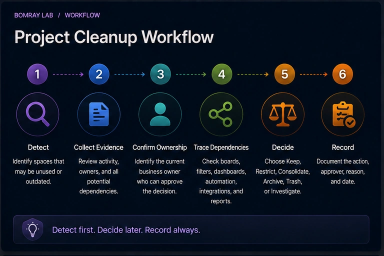
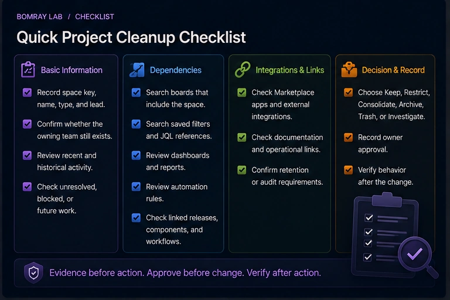
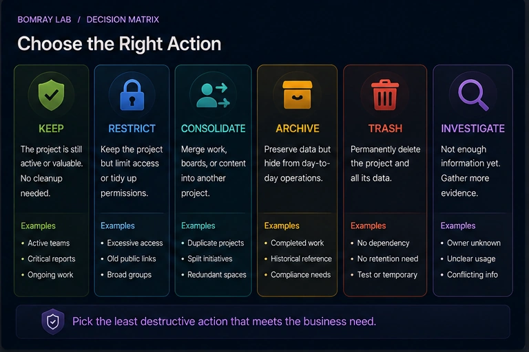

Jira projects—called **spaces** in current Atlassian Cloud administration documentation—often outlive the team, initiative, migration, or temporary process that created them. An old space may have no recent work item updates, but that alone does not mean it is safe to archive or trash.

A space can still supply work items to boards, saved filters, dashboards, automation rules, reports, integrations, or historical audit processes. The administrator's job is to separate “quiet” from “unneeded.”

> **Quick answer**
>
> Use inactivity only to build a candidate list. Before archiving a Jira space, confirm its business owner, review recent activity and unresolved work, trace boards, filters, dashboards, automation, integrations, and retention requirements, then choose **Keep, Restrict, Consolidate, Archive, Trash, or Investigate**. Archive is usually safer than trash when the content may still be needed for reference.

## Search Intent

People searching for **Jira unused projects**, **inactive Jira projects**, or **how to archive a Jira project** are usually trying to reduce clutter without losing information or breaking reporting.

The real questions are:

- Which spaces are genuinely inactive?
- What dependencies should be checked?
- Is archive different from trash?
- What happens to work items after archiving?
- Who should approve the decision?

This guide focuses on those administrative decisions.

## Why Project Cleanup Requires More Than a Last-Updated Date

Atlassian's current Site optimizer can help administrators identify spaces that have not been updated recently. That is useful detection evidence.

It is not a complete dependency map.

A space with little recent activity may still be:

- referenced by a cross-space board;
- included in saved JQL filters;
- used by a dashboard or report;
- queried by an automation rule;
- connected to a Marketplace app or external integration;
- retained for audit, contractual, legal, or historical reasons;
- the source of links in documentation or runbooks.

The first rule of cleanup is the same as in the [Jira Cleanup Checklist](/resources/jira-cleanup-checklist/): **detect first, decide later**.

## Workflow: Detect → Evidence → Owner → Dependencies → Decide → Record

### Detect

Start with candidates that show one or more signals:

- no recent work item updates;
- no active owner or team;
- completed initiative;
- duplicate or migrated space;
- obsolete naming or category;
- known temporary project;
- Site optimizer recommendation where available.

Do not turn these signals into automatic archive rules.

### Collect evidence

For each candidate, record:

- space key and name;
- company-managed or team-managed;
- lead or known owner;
- last meaningful work activity;
- open work items;
- unresolved or future-dated work;
- boards and saved filters that include the space;
- dashboards and reports;
- automation;
- apps and integrations;
- retention requirement.

### Confirm ownership

Find the team or role that can answer whether the space still serves a business purpose.

If no owner exists, classify it as **Investigate** until enough evidence is available.

### Trace dependencies

Check both Jira-native and external consumers before taking action.

### Decide

Choose the least destructive action that meets the cleanup goal.

### Record

Record the evidence date, approver, action, reason, and restore owner.

## Quick Project Cleanup Checklist

- [ ] Record the space key, name, type, and lead.
- [ ] Confirm whether the owning team still exists.
- [ ] Review recent and historical work activity.
- [ ] Check unresolved, blocked, or future work.
- [ ] Search boards that include the space.
- [ ] Search saved filters and JQL references.
- [ ] Review dashboards and reports.
- [ ] Review automation rules.
- [ ] Review linked releases, components, and workflows where relevant.
- [ ] Check Marketplace apps and external integrations.
- [ ] Check documentation and operational links.
- [ ] Confirm retention or audit requirements.
- [ ] Choose Keep, Restrict, Consolidate, Archive, Trash, or Investigate.
- [ ] Record owner approval.
- [ ] Verify behavior after the change.

## Step 1: Use Inactivity as a Candidate Signal

Atlassian's Site optimizer includes a **Spaces** cleanup area that can filter spaces by last updated time and allows administrators to select candidates for **Archive** or **Trash**.

That is a strong starting point because it reduces manual discovery.

But “last updated” only answers one question: *when did Jira last record activity in this space?*

It does not answer whether another Jira object still references that content.

Set a candidate threshold appropriate to your organization—for example six, twelve, or eighteen months—but keep the threshold in your governance policy, not as an automatic delete rule.

## Step 2: Check the Work, Not Just the Space Metadata

Open the candidate and inspect the work itself.

Look for:

- unresolved work items;
- scheduled or future work;
- recurring operational tasks;
- compliance or audit evidence;
- recently viewed or referenced records known to the team;
- links from active work in other spaces.

A completed initiative can still have high historical value.

If the content should remain available for reference but should no longer appear in normal search and editing workflows, archive is often the better fit.

## Step 3: Trace Boards and Saved Filters

Company-managed boards can be created from saved filters, and those filters can include work from multiple spaces.

That means archiving one quiet space may affect a board owned by a completely different team.

Search for:

- filters containing the space key;
- filters that refer to its components, versions, labels, or custom values;
- boards based on those filters;
- quick filters that assume the space exists.

A filter dependency can be more important than the apparent activity level of the space.

## Step 4: Review Dashboards and Reporting

Dashboards frequently depend on saved filters.

Check:

- filter results gadgets;
- charts based on filters;
- executive or operational dashboards;
- subscriptions;
- external BI exports.

If the space is only used for historical reporting, you may still decide to archive it—but validate the report after the archive.

Archived work items no longer appear in basic or advanced Jira search results. A dashboard or saved filter that depends on normal search may therefore change.

## Step 5: Check Automation and Integrations

Search Jira automation rules for:

- space key conditions;
- branch rules scoped to the space;
- work item creation actions;
- scheduled JQL;
- transitions or field updates involving the space.

Also check external dependencies:

- REST API clients;
- data warehouse ingestion;
- synchronization tools;
- incident or support integrations;
- Marketplace apps.

Do not assume the Jira UI exposes every consumer.

## Step 6: Choose Archive, Trash, or Another Outcome

### Keep

Use when the space still has an active business purpose.

### Restrict

Use when the content remains valid but broad access or active configuration should be reduced.

### Consolidate

Use when several spaces represent one continuing process and can be migrated into a canonical space.

### Archive

Current Atlassian Cloud documentation states that Jira and site admins can archive and restore company-managed and team-managed spaces, while space admins can archive team-managed spaces.

When a space is archived, its work items do not appear in basic or advanced search. They can still be reached by direct links, but cannot be edited.

Use archive when the space is no longer active but should remain available as historical reference.

### Trash

Trash is a stronger removal state. Atlassian documents that spaces in trash also disappear from basic and advanced search. Direct links can still reach the work items, but they cannot be edited.

Only move a space to trash when the organization has decided it is no longer needed.

### Investigate

Use when the owner, dependency chain, or retention requirement is unclear.

## Step 7: Understand Archive vs Trash

Archive and trash are not interchangeable governance labels.

| Question | Archive | Trash |
|---|---|---|
| Intended use | Retain inactive historical space | Remove space no longer needed |
| Search results | Work items excluded | Work items excluded |
| Direct link | Accessible | Accessible |
| Editing | Not available | Not available |
| Restore | Supported | Supported before permanent deletion |
| Governance posture | Retention | Removal |

Atlassian's trash documentation also provides a path to permanent deletion from the Trash administration area. Permanent deletion should be treated as destructive.

If retention matters, archive first.

## Evidence to Capture Before You Archive

A useful review record should be detailed enough that another administrator can understand the decision months later.

Capture at least:

| Evidence | Example question |
|---|---|
| Last meaningful update | Was the latest change real work or an administrative edit? |
| Open work | Are there unresolved work items, future due dates, or recurring tasks? |
| Ownership | Which current team can approve the lifecycle decision? |
| Search dependencies | Which filters include the space key or its fields? |
| Board dependencies | Does a cross-space board include this space? |
| Reporting | Is historical work used in dashboards, subscriptions, or BI? |
| Automation | Do scheduled or event-based rules query this space? |
| Integrations | Does an external client read or write work here? |
| Retention | Does policy require continued reference access? |

Avoid a single `lastUpdatedAt` style metric as the entire evidence set. An administrative migration or bulk edit can make an abandoned space look recent, while a stable reference space can legitimately look old.

## A Practical Archive Validation Sequence

Before archiving, perform a short validation with the owner.

### 1. Save the current state

Record the space key, owner, major boards, important filters, and any known integrations. You do not need to export every object; you need enough evidence to recognize unexpected impact.

### 2. Identify representative consumers

Choose at least one real consumer for each dependency category that matters:

- one saved filter;
- one board;
- one dashboard/report;
- one automation rule;
- one integration if applicable.

### 3. Archive the space

Perform the approved action using the current Jira administration controls.

### 4. Re-run the representative consumers

Because archived work items are excluded from normal basic and advanced search, filters and reports may return fewer results. Verify that this is expected.

### 5. Record the outcome

If a dependency breaks or a stakeholder still needs active work, restore the space and reclassify the candidate.

This approach turns “archive and hope” into a controlled change.

## Example Decisions

### Example: completed migration space

A migration space has no open work, all target records were moved to the production space, and its only remaining purpose is audit reference.

**Decision:** Archive.

**Why:** Historical value remains, but active search and editing are no longer required.

### Example: quiet compliance space

A compliance team updates a space only during annual review. It has been quiet for eleven months.

**Decision:** Keep.

**Why:** The inactivity is expected and the owner confirms the next review cycle.

### Example: abandoned experiment with cross-space board dependency

The space has no owner and no recent work, but a portfolio board uses a filter containing its key.

**Decision:** Investigate, then update the board/filter before archive or trash.

**Why:** The dependency must be migrated first.

### Example: empty test space

A Jira admin confirms the test space was created for a one-day configuration experiment, contains no required work, has no filters, boards, automation, integrations, or retention need.

**Decision:** Trash after approval.

**Why:** There is no continuing business or historical purpose.

## Best Practices

### Make space ownership explicit

A lead field is useful, but governance should identify the business owner responsible for approving lifecycle decisions.

### Prefer archive for uncertain historical value

Archive reduces active clutter without treating the content as disposable.

### Review dependencies before bulk actions

Bulk cleanup saves administrator time only when the candidate criteria are trustworthy. Dependency review should still happen before a destructive batch.

### Maintain a cleanup register

Record space key, owner, decision, evidence, date, approver, and restore contact.

### Trigger reviews after organizational change

Migrations, acquisitions, reorganizations, completed programs, and app decommissioning are natural cleanup triggers.

## Common Mistakes

### Archiving everything older than a fixed date

Age is a signal, not proof. Some spaces become historical systems of record.

### Checking open work but ignoring filters

A space with zero active work can still feed cross-space reports.

### Treating archive as deletion

Archive changes search and editing behavior. It is a retention state, not a no-op.

### Moving spaces to trash without a named approver

Technical administrators should not decide business retention alone.

### Forgetting external systems

A REST client can depend on a space even when no Jira dashboard does.

## Before and After

A weak cleanup produces fewer spaces.

A strong cleanup produces a space inventory with known lifecycle states.

| Before | After |
|---|---|
| Old spaces selected by age | Candidates selected by evidence |
| Owner unknown | Business owner confirmed |
| Boards and filters ignored | Search dependencies traced |
| External integrations assumed | Integrations explicitly checked |
| Archive and trash treated the same | Retention and removal separated |
| No record of why | Decision and restore owner recorded |

## FAQ

### What does Jira call projects now?

Current Atlassian Cloud administration documentation increasingly uses **spaces** where older Jira documentation and UI historically used **projects**. Searchers still commonly use “Jira project,” so this guide uses both terms where helpful.

### Can Jira administrators archive a space?

Yes. Atlassian currently documents archive and restore for company-managed and team-managed spaces by Jira and site admins. Team-managed space admins also have archive capability for their own spaces.

### What happens to work items in an archived space?

They no longer appear in basic or advanced search results. Direct links can still access them, but they cannot be edited while archived.

### Should I archive a project because it has no updates?

Not automatically. Check unresolved work, ownership, filters, boards, dashboards, automation, integrations, and retention requirements.

### Is trash the same as archive?

No. Archive is the safer retention-oriented state. Trash is part of the removal path and can lead to permanent deletion.

### Can an archived space be restored?

Yes. Jira/site admins can access the archive and restore archived spaces.

### Should I delete empty spaces immediately?

Not necessarily. An empty space can still have configuration, links, automation, or integration relevance. Verify the dependency chain first.

## Summary

Use inactivity to find review candidates, not to make the final decision.

For each candidate Jira space:

- confirm the business owner;
- review meaningful activity and unresolved work;
- trace saved filters, boards, dashboards, and reports;
- check automation, apps, APIs, and external integrations;
- confirm retention requirements;
- choose Keep, Restrict, Consolidate, Archive, Trash, or Investigate;
- record the approval and restore path.

Manual review works well for smaller Jira sites. As the number of spaces grows, candidate detection and evidence collection become harder. [Needs Attention for Jira](/apps/) can help surface spaces that deserve review while leaving lifecycle decisions to Jira administrators.

## Official References

- <a href="https://support.atlassian.com/jira-cloud-administration/docs/optimize-the-number-of-projects-in-your-site/" target="_blank" rel="noopener noreferrer">Optimize the number of spaces in your site — Atlassian Support</a>
- <a href="https://support.atlassian.com/jira-cloud-administration/docs/archive-a-project/" target="_blank" rel="noopener noreferrer">Archive a space — Atlassian Support</a>
- <a href="https://support.atlassian.com/jira-cloud-administration/docs/trash-for-jira-cloud-projects/" target="_blank" rel="noopener noreferrer">Trash for Jira Cloud spaces — Atlassian Support</a>
- <a href="https://support.atlassian.com/jira-cloud-administration/docs/restore-a-project-from-trash/" target="_blank" rel="noopener noreferrer">Restore a space from trash — Atlassian Support</a>
- <a href="https://support.atlassian.com/jira-cloud-administration/docs/delete-a-project/" target="_blank" rel="noopener noreferrer">Delete a space — Atlassian Support</a>
- <a href="https://support.atlassian.com/jira-software-cloud/docs/create-a-board-based-on-filters/" target="_blank" rel="noopener noreferrer">Create a board based on filters — Atlassian Support</a>
