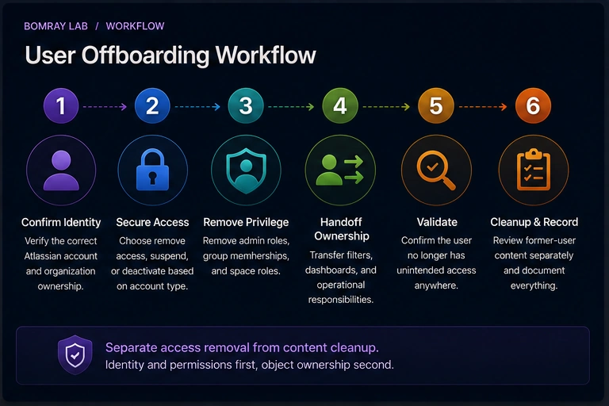
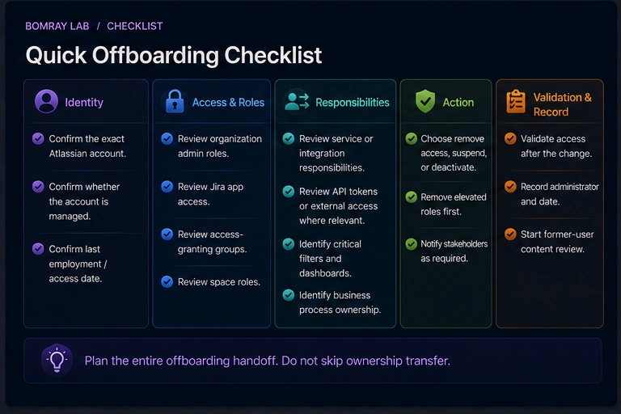
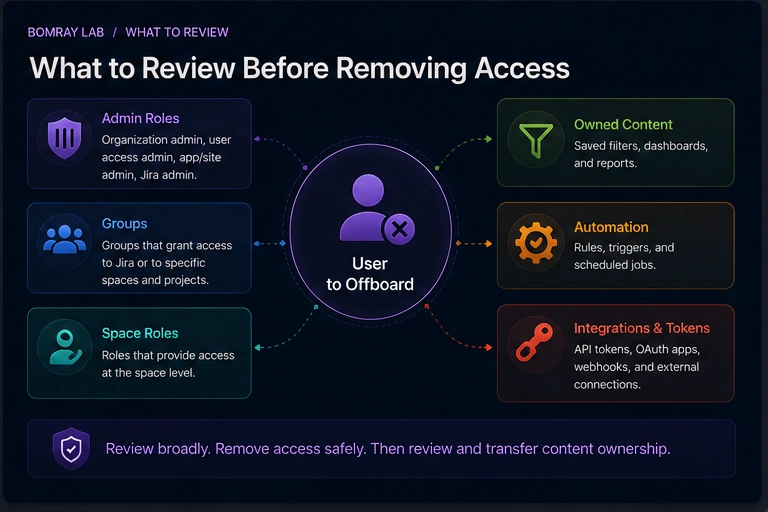

User offboarding in Jira is not one button.

An administrator may need to remove app access, suspend access, deactivate a managed account, remove elevated roles, transfer operational responsibility, and then review Jira objects the former user owned.

Those are related tasks, but they are not the same task.

> **Quick answer**
>
> Separate **identity/access removal** from **Jira content cleanup**. First determine whether the account is managed, whether access should be removed or suspended, and whether admin roles must be revoked. Then verify groups, space roles, operational ownership, API/token implications, and required handoff. After access is secured, perform a separate review of filters, dashboards, automation, and other former-user dependencies.

## Search Intent

People searching for **Jira offboarding**, **Jira deactivate user**, or **remove Jira user access** need a safe sequence.

Common goals:

- stop a departing employee from accessing Jira;
- remove license/app access;
- preserve work history;
- transfer ownership;
- avoid broken boards, filters, or reports.

This article focuses on the **access lifecycle**. A later cleanup article covers orphaned Jira objects after the account is already offboarded.

## Why Offboarding Must Separate Access and Ownership

Atlassian Cloud has organization-level user management and Jira-level configuration.

A person may be:

- an organization admin;
- a user access admin;
- a site or app admin;
- a member of access-granting groups;
- a member of space roles;
- owner of Jira filters or dashboards;
- author or actor in work history;
- creator of API tokens or external integrations.

Removing one form of access does not automatically resolve every other responsibility.

## Offboarding Workflow

Use:

**Confirm Identity → Secure Access → Remove Privilege → Handoff → Validate → Cleanup**

### Confirm identity

Verify the correct Atlassian account and organization.

### Secure access

Choose the correct user-management action.

### Remove privilege

Review administrator roles and groups.

### Handoff

Identify responsibilities that must move before or immediately after removal.

### Validate

Confirm the user no longer has unintended access.

### Cleanup

Review owned Jira content separately.

## Quick Offboarding Checklist

- [ ] Confirm the exact Atlassian account.
- [ ] Confirm whether the account is managed.
- [ ] Confirm last employment/access date.
- [ ] Review organization/admin roles.
- [ ] Review Jira app access.
- [ ] Review access-granting groups.
- [ ] Review space roles.
- [ ] Review service or integration responsibilities.
- [ ] Review API/token use where relevant.
- [ ] Identify critical filters and dashboards.
- [ ] Identify business process ownership.
- [ ] Choose remove access, suspend, or deactivate as appropriate.
- [ ] Validate access after the change.
- [ ] Record the administrator and date.
- [ ] Start former-user Jira content review.

## Step 1: Determine Whether the Account Is Managed

Atlassian distinguishes managed accounts from accounts your organization does not manage.

Atlassian states that organizations can deactivate or delete managed accounts. If the organization does not manage the account, Atlassian directs administrators toward suspending access instead.

This distinction matters because “deactivate user” may refer to different scopes in older operational language.

Use current Atlassian Administration controls and document the exact action taken.

## Step 2: Choose Remove Access, Suspend, or Deactivate

### Remove app access

Atlassian's current user-management documentation allows administrators to remove app access from a user. The action removes the user from groups that grant access to that app.

Use this when the goal is to remove Jira app access while the account may remain in the organization.

### Suspend access

Suspension is reversible and can be appropriate when access should stop without permanently removing organizational identity.

### Deactivate managed account

For managed accounts, deactivation prevents the account from accessing apps across organizations and other Atlassian services described in the account documentation.

The correct action depends on identity ownership, organizational policy, and scope.

Do not invent one universal offboarding action.

## Step 3: Remove Elevated Administrative Roles First

Before routine access cleanup, review whether the user is:

- organization admin;
- user access admin;
- site/app administrator;
- Jira administrator.

Atlassian notes that some access-removal actions require removing an organization admin role first.

This is a security-critical handoff.

Make sure another authorized administrator remains available before removing the departing user's admin role.

## Step 4: Review Groups That Grant App Access

Atlassian app access can be granted through groups.

Removing Jira app access can remove the user from groups that grant that app.

However, groups may also carry other administrative or operational meaning.

Record important group membership before offboarding if downstream teams need the evidence.

Do not re-add a former user to a group later just to discover what permissions they had; preserve the access snapshot.

## Step 5: Review Space Roles and Business Responsibilities

A Jira space role may grant:

- browse;
- edit;
- transition;
- administer-space capabilities;
- notification responsibilities.

Review whether the user is a unique member of a critical role.

If they are the only operational administrator or business owner in a space, assign a successor.

This is a handoff task, not a reason to delay access revocation when security requires immediate removal.

## Step 6: Review API and Integration Risk

Atlassian's current support guidance notes an important token risk: simply deactivating or unsyncing a user through some identity paths does not necessarily remove site/product access, and API tokens may continue to work while the account still has site access.

For offboarding, verify:

- site/app access is actually removed or suspended;
- personal API tokens are not being used as production service credentials;
- integrations have a supported service identity or current owner.

Avoid building long-lived operational integrations around personal employee credentials.

## Step 7: Preserve Work History

Removing access does not mean rewriting historical attribution.

Work items, comments, and audit history can have business value.

The cleanup target is active access and operational ownership—not erasing evidence that the person previously performed work.

If retention requirements apply, coordinate with your organization's records and privacy policies.

## Step 8: Identify Owned Jira Objects for Follow-Up

Before or immediately after access removal, create a follow-up list for:

- saved filters;
- dashboards;
- boards that depend on filters;
- automation rules;
- subscriptions;
- documented integration ownership.

Do not try to solve every dependency inside the access-removal step.

Separating phases makes the security objective clear: **stop access first, then restore governance.**

## Decision Guide

| Situation | Primary action |
|---|---|
| User leaves organization; managed account | Follow managed-account deactivation policy |
| User should remain in org but lose Jira | Remove Jira app access |
| Temporary hold or reversible access stop | Suspend access where appropriate |
| User has admin role | Transfer responsibility and revoke privilege |
| User owns operational Jira objects | Queue object-level ownership review |
| Personal token powers integration | Replace with governed integration identity |

## Recommended Offboarding Evidence Record

For each departure, retain an administrative record appropriate to your organization's policy.

| Evidence | Why it matters |
|---|---|
| Atlassian account | Prevents acting on the wrong user |
| Managed/unmanaged state | Determines available account actions |
| Last authorized date | Establishes access cutoff |
| App access | Confirms Jira entitlement |
| Admin roles | Identifies privileged handoff |
| Access groups | Explains current entitlement |
| Space roles | Identifies local responsibility |
| Integration/token use | Finds machine dependencies |
| Critical owned objects | Creates cleanup queue |
| Successor | Establishes accountability |
| Action/time/admin | Audit evidence |

This record should contain only the operational information your organization needs. Do not turn offboarding into unnecessary collection of personal data.

## Offboarding Sequence for High-Risk Users

A Jira administrator or integration owner needs a tighter sequence than a normal user.

### Before the cutoff

Where policy allows, identify a successor for:

- organization/site administration;
- Jira administration;
- critical space administration;
- production integrations.

### At the cutoff

Remove or suspend the access required by policy.

Do not leave privileged access active only because a dashboard transfer is incomplete.

### Immediately after

Validate:

- Jira access;
- elevated roles;
- app access groups;
- integration health.

### Follow-up

Create the Jira configuration cleanup task for owned filters, dashboards, boards, automation, and other operational artifacts.

## Special Case: User Changes Teams but Does Not Leave

Not every offboarding event is termination from the organization.

For an internal transfer:

- the Atlassian account may remain active;
- Jira app access may remain valid;
- old space roles may need removal;
- new space roles may need assignment;
- operational object ownership may need transfer.

This is better described as **role offboarding**.

Use the same evidence process without applying account-level deactivation unnecessarily.

## Special Case: Contractor or Temporary Access

Temporary access should have an expected end date.

At the end:

- remove or suspend Jira access as required;
- review temporary groups and roles;
- verify shared dashboards/filters they created;
- replace personal integration credentials;
- record completion.

Temporary users often create disproportionate cleanup risk because their work is valid but their organizational tenure is short.

## Validate the Result

After the access action, test the outcome from the administrative side.

Confirm:

- the user no longer has Jira app access when that was the goal;
- admin roles are revoked;
- no accidental replacement grant re-enabled access;
- critical integrations still operate under valid credentials;
- successor administrators can perform required tasks.

Offboarding is complete only when the resulting state matches the intended policy.

## Define the Offboarding Approval Boundary

Access removal should have a clear authority. The Jira administrator should know who can approve account suspension, app-access removal, privileged-role removal, and ownership handoff. This prevents a configuration discussion from becoming an employment decision.

For urgent departures, follow the organization's security process first. Jira cleanup can continue after access is secured. For planned departures, complete the ownership inventory early enough that business owners can accept critical responsibilities before the final access date.

## Best Practices

### Use an HR or identity trigger

Offboarding should begin from an authoritative employment/access event, not from ad hoc Jira cleanup.

### Keep an access snapshot

Record high-risk roles and groups before removal.

### Use service identities for integrations

Personal accounts create avoidable offboarding dependencies.

### Separate emergency access revocation from cleanup

Security should not wait for a perfect inventory of filters and dashboards.

### Assign successor owners by business function

Do not default everything to the Jira administrator.

## Common Mistakes

### Removing app access and assuming cleanup is complete

Owned filters, dashboards, and automation may still need attention.

### Deactivating an account but leaving effective site access in another path

Validate the final state.

### Leaving a departing admin as the only administrator

Transfer privileged responsibility first.

### Keeping access active until every ownership question is solved

Security access removal and ownership cleanup are separate phases.

### Running integrations with personal API tokens

This creates hidden offboarding risk.

## Before and After

| Before | After |
|---|---|
| Departing user has broad Jira access | Access removed or suspended intentionally |
| Admin role has no successor | Authorized successor assigned |
| Group membership undocumented | Access snapshot recorded |
| Personal integration identity | Governed integration owner |
| Owned objects ignored | Cleanup queue created |

## FAQ

### What is the difference between removing Jira access and deactivating an account?

Removing app access targets access to a specific Atlassian app. Deactivating a managed account is an account-level action with broader effect.

### Can I deactivate any Atlassian account?

No. Atlassian states that deactivation/deletion applies to managed accounts. For accounts the organization does not manage, suspension/access controls are used instead.

### Does removing Jira access delete the user's work?

No. Access management is not the same as deleting historical Jira work.

### Should I transfer every filter and dashboard before removing access?

Not if that delays required security action. Secure access, identify critical dependencies, then complete an evidence-based ownership review.

### What about API tokens?

Validate actual site/app access and replace personal credentials used by production integrations.

### Should I remove space-role membership separately?

Review it as part of governance. Effective app access and configuration references are different concerns.

## Summary

A Jira offboarding process should achieve two outcomes:

1. the former user no longer has unintended access;
2. operational responsibility is not left ownerless.

Do this by separating identity actions from Jira-object cleanup.

After the account is secured, [Needs Attention for Jira](/apps/) can help surface Jira objects that deserve ownership review while leaving transfer or removal decisions to Jira administrators.

## Official References

- <a href="https://support.atlassian.com/user-management/docs/remove-or-suspend-a-user/" target="_blank" rel="noopener noreferrer">Remove user or suspend their access — Atlassian Support</a>
- <a href="https://support.atlassian.com/user-management/docs/remove-product-access-for-users/" target="_blank" rel="noopener noreferrer">Remove app access for users — Atlassian Support</a>
- <a href="https://support.atlassian.com/user-management/docs/deactivate-a-managed-account/" target="_blank" rel="noopener noreferrer">Deactivate a managed account — Atlassian Support</a>
- <a href="https://support.atlassian.com/user-management/docs/give-users-admin-permissions/" target="_blank" rel="noopener noreferrer">Give users admin permissions — Atlassian Support</a>
- <a href="https://support.atlassian.com/jira-cloud-administration/docs/manage-project-role-membership/" target="_blank" rel="noopener noreferrer">How to use space roles — Atlassian Support</a>
- <a href="https://support.atlassian.com/jira/kb/atlassian-api-token-key-status-of-api-tokens-keys-when-a-user-who-generated-the-token-key-has-left-the-organization/" target="_blank" rel="noopener noreferrer">API token status when a user leaves — Atlassian Support</a>
